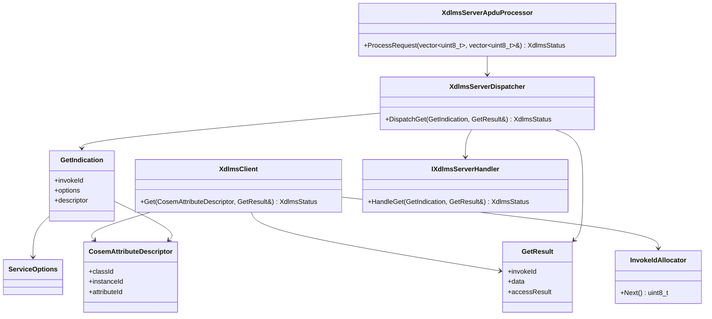

# dlms-xdlms API

## 1. Public Headers

Public headers:

```text
include/dlms/xdlms/xdlms_status.hpp
include/dlms/xdlms/xdlms_types.hpp
include/dlms/xdlms/xdlms_client.hpp
include/dlms/xdlms/xdlms_server.hpp
```

No C ABI is planned for the first implementation.

## 2. Status

`XdlmsStatus` shall be a stable status contract:

- `Ok`
- `InvalidArgument`
- `InvalidState`
- `NotAssociated`
- `SendFailed`
- `ReceiveFailed`
- `EncodeFailed`
- `DecodeFailed`
- `InvokeIdMismatch`
- `ServiceRejected`
- `BlockTransferRequired`
- `UnsupportedFeature`
- `InternalError`

## 3. Types

`CosemLogicalName` is a six-byte logical-name value.

`CosemAttributeDescriptor` contains:

- `classId`
- `instanceId`
- `attributeId`

`ServiceOptions` contains:

- `confirmed`
- `highPriority`

The default is confirmed normal priority.

`GetResult` contains:

- `invokeId`
- `hasData`
- `data`
- `hasAccessResult`
- `accessResult`

The first phase keeps `data` as encoded xDLMS data bytes. Typed COSEM data
projection belongs to later service/facade work.

## 4. Client

```cpp
dlms::xdlms::XdlmsClient client(channel, association);

dlms::xdlms::CosemAttributeDescriptor descriptor = {};
descriptor.classId = 1;
descriptor.instanceId = dlms::xdlms::CosemLogicalName(0, 0, 1, 0, 0, 255);
descriptor.attributeId = 2;

dlms::xdlms::GetResult result;
const dlms::xdlms::XdlmsStatus status = client.Get(descriptor, result);
```

`XdlmsClient` does not own the association object and does not own the profile
APDU channel. The caller must keep both alive for the client lifetime.

## 5. Server

The server-side boundary accepts decoded xDLMS service models and delegates the
actual COSEM access to an embedding handler:

```cpp
class IXdlmsServerHandler {
public:
  virtual ~IXdlmsServerHandler() = default;

  virtual XdlmsStatus HandleGet(const GetIndication& indication,
                                GetResult& result) = 0;
};
```

`GetIndication` contains:

- `invokeId`
- `options`
- `descriptor`

`XdlmsServerDispatcher` validates the indication, calls the handler, and keeps
the response invoke id aligned with the request.

```cpp
dlms::xdlms::XdlmsServerDispatcher dispatcher(handler);

dlms::xdlms::GetIndication indication = {};
indication.invokeId = 1;
indication.descriptor.classId = 1;
indication.descriptor.instanceId = dlms::xdlms::CosemLogicalName(0, 0, 1, 0, 0, 255);
indication.descriptor.attributeId = 2;

dlms::xdlms::GetResult result;
const dlms::xdlms::XdlmsStatus status = dispatcher.DispatchGet(indication, result);
```

The handler contract is intentionally independent from `dlms-server`; the
server repo can implement an adapter without making `dlms-xdlms` depend on
higher layers.

## 6. Server APDU Boundary

`XdlmsServerApduProcessor` decodes an unprotected xDLMS APDU, dispatches the
GET indication, and encodes the GET response:

```cpp
dlms::xdlms::XdlmsServerDispatcher dispatcher(handler);
dlms::xdlms::XdlmsServerApduProcessor processor(dispatcher);

std::vector<std::uint8_t> response;
const dlms::xdlms::XdlmsStatus status =
  processor.ProcessRequest(requestApdu, response);
```

`ProcessRequest` clears `response` before work starts and writes response bytes
only when encoding succeeds.

Supported first APDU shape:

- input: GET-REQUEST-NORMAL, no selective access;
- output: GET-RESPONSE-NORMAL with either data or data-access-result.

Unsupported first APDU shapes:

- GET-NEXT;
- GET-WITH-LIST;
- selective access;
- SET;
- ACTION;
- ciphered APDUs;
- ACSE APDUs.

## 7. Module Diagram


