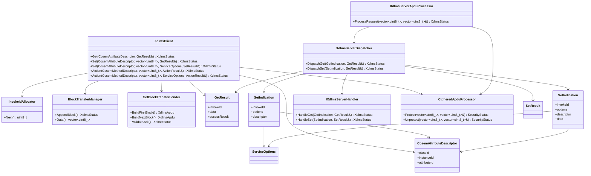

# dlms-xdlms API

## 1. Public Headers

Public headers:

```text
include/dlms/xdlms/xdlms_status.hpp
include/dlms/xdlms/xdlms_types.hpp
include/dlms/xdlms/xdlms_client.hpp
include/dlms/xdlms/xdlms_server.hpp
```

No C ABI is planned for the first implementation.

## 2. Status

`XdlmsStatus` shall be a stable status contract:

- `Ok`
- `InvalidArgument`
- `InvalidState`
- `NotAssociated`
- `SendFailed`
- `ReceiveFailed`
- `EncodeFailed`
- `DecodeFailed`
- `InvokeIdMismatch`
- `ServiceRejected`
- `BlockTransferRequired`
- `UnsupportedFeature`
- `SecurityFailed`
- `InternalError`

## 3. Types

`CosemLogicalName` is a six-byte logical-name value.

`CosemAttributeDescriptor` contains:

- `classId`
- `instanceId`
- `attributeId`

`ServiceOptions` contains:

- `confirmed`
- `highPriority`
- `allowBlockTransfer`
- `maxBlockTransferBytes`
- `maxSetBlockPayloadBytes`
- future `maxActionBlockPayloadBytes`

The default is confirmed normal priority.
Block transfer is enabled by default with a finite maximum collected payload
size.

`GetResult` contains:

- `invokeId`
- `hasData`
- `data`
- `hasAccessResult`
- `accessResult`

The first phase keeps `data` as encoded xDLMS data bytes. Typed COSEM data
projection belongs to later service/facade work.
For GET response block transfer, `data` contains the concatenated raw-data
bytes from all accepted response blocks.

`SetResult` contains:

- `invokeId`
- `accessResult`

`accessResult` is the SET-RESPONSE-NORMAL `Data-Access-Result` value. A value
of `0` represents success.

## 4. Client

```cpp
dlms::xdlms::XdlmsClient client(channel, association);
dlms::xdlms::XdlmsClient secureClient(channel, association, security);

dlms::xdlms::CosemAttributeDescriptor descriptor = {};
descriptor.classId = 1;
descriptor.instanceId = dlms::xdlms::CosemLogicalName(0, 0, 1, 0, 0, 255);
descriptor.attributeId = 2;

dlms::xdlms::GetResult result;
const dlms::xdlms::XdlmsStatus status = client.Get(descriptor, result);
```

`XdlmsClient` does not own the association object, profile APDU channel, or
optional security processor. The caller must keep all supplied objects alive for
the client lifetime.

When constructed with a `dlms::security::CipheredApduProcessor`, the client
protects encoded request APDUs before `SendApdu()` and unprotects received
response APDUs before xDLMS decode. The public GET/SET/ACTION service contract
does not otherwise change.

## 5. Server

The server-side boundary accepts decoded xDLMS service models and delegates the
actual COSEM access to an embedding handler:

```cpp
class IXdlmsServerHandler {
public:
  virtual ~IXdlmsServerHandler() = default;

  virtual XdlmsStatus HandleGet(const GetIndication& indication,
                                GetResult& result) = 0;

  virtual XdlmsStatus HandleSet(const SetIndication& indication,
                                SetResult& result);
};
```

`GetIndication` contains:

- `invokeId`
- `options`
- `descriptor`

`SetIndication` contains:

- `invokeId`
- `options`
- `descriptor`
- `data`

`data` carries encoded xDLMS `Data` bytes from SET-REQUEST-NORMAL. The default
`HandleSet` implementation returns `UnsupportedFeature`, allowing existing
GET-only handlers to remain valid until they explicitly support SET.

`XdlmsServerDispatcher` validates the indication, calls the handler, and keeps
the response invoke id aligned with the request.

```cpp
dlms::xdlms::XdlmsServerDispatcher dispatcher(handler);

dlms::xdlms::GetIndication indication = {};
indication.invokeId = 1;
indication.descriptor.classId = 1;
indication.descriptor.instanceId = dlms::xdlms::CosemLogicalName(0, 0, 1, 0, 0, 255);
indication.descriptor.attributeId = 2;

dlms::xdlms::GetResult result;
const dlms::xdlms::XdlmsStatus status = dispatcher.DispatchGet(indication, result);
```

```cpp
dlms::xdlms::SetIndication indication = {};
indication.invokeId = 1;
indication.descriptor.classId = 1;
indication.descriptor.instanceId = dlms::xdlms::CosemLogicalName(0, 0, 1, 0, 0, 255);
indication.descriptor.attributeId = 2;
indication.data = {0x12, 0x00, 0x01};

dlms::xdlms::SetResult result;
const dlms::xdlms::XdlmsStatus status = dispatcher.DispatchSet(indication, result);
```

The handler contract is intentionally independent from `dlms-server`; the
server repo can implement an adapter without making `dlms-xdlms` depend on
higher layers.

## 6. Server APDU Boundary

`XdlmsServerApduProcessor` decodes an unprotected xDLMS APDU, dispatches the
GET or SET indication, and encodes the corresponding response:

```cpp
dlms::xdlms::XdlmsServerDispatcher dispatcher(handler);
dlms::xdlms::XdlmsServerApduProcessor processor(dispatcher);
dlms::xdlms::XdlmsServerApduProcessor secureProcessor(dispatcher, security);

std::vector<std::uint8_t> response;
const dlms::xdlms::XdlmsStatus status =
  processor.ProcessRequest(requestApdu, response);
```

`ProcessRequest` clears `response` before work starts and writes response bytes
only when encoding succeeds. When constructed with a
`dlms::security::CipheredApduProcessor`, the processor unprotects the request
before xDLMS decode and protects the encoded response before returning it.

The processor owns one server-side ACTION request block-transfer state. A
single processor instance is therefore scoped to one association/session when
ACTION request pblocks are enabled.

Supported first APDU shape:

- input: GET-REQUEST-NORMAL, no selective access;
- output: GET-RESPONSE-NORMAL with either data or data-access-result.
- input: SET-REQUEST-NORMAL, no selective access;
- output: SET-RESPONSE-NORMAL with data-access-result.

Unsupported first APDU shapes:

- GET-NEXT;
- GET-WITH-LIST;
- SET-WITH-FIRST-DATABLOCK;
- SET-WITH-DATABLOCK;
- SET-WITH-LIST;
- SET-WITH-LIST-AND-FIRST-DATABLOCK;
- selective access;
- unsupported ACTION shapes except documented single-method ACTION request
  pblocks;
- ciphered APDUs when the processor was not constructed with a security
  processor;
- ACSE APDUs.

Security failures map to `SecurityFailed`. This includes protection,
unprotection, authentication, replay, missing-key, invalid-key, and invocation
counter failures reported by `dlms-security`.

## 7. Block Transfer

`XdlmsClient::Get()` owns the first client-side block transfer increment. The
method keeps its public signature and consumes `GET-RESPONSE-WITH-DATABLOCK`
responses internally when `ServiceOptions::allowBlockTransfer` is enabled.

Unsupported block-transfer forms still return `BlockTransferRequired`.
Malformed or out-of-order block sequences return `DecodeFailed`.

`XdlmsClient::Set()` owns the next client-side block transfer increment. The
default overload keeps the existing signature. An options-aware overload allows
callers to disable block transfer or choose a smaller SET block payload:

```cpp
dlms::xdlms::SetResult result;
dlms::xdlms::ServiceOptions options = dlms::xdlms::DefaultServiceOptions();
options.maxSetBlockPayloadBytes = 128;

const dlms::xdlms::XdlmsStatus status =
  client.Set(descriptor, encodedData, options, result);
```

Blocked SET sends `SET-REQUEST-WITH-FIRST-DATABLOCK` followed by
`SET-REQUEST-WITH-DATABLOCK` requests. The final response is
`SET-RESPONSE-LAST-DATABLOCK`.

`XdlmsClient::Action()` owns ACTION response-side pblock collection. The default
overload keeps the existing signature. The options-aware overload allows callers
to disable block transfer and to select confirmed/high-priority invoke-id
flags:

```cpp
dlms::xdlms::ActionResult result;
dlms::xdlms::ServiceOptions options = dlms::xdlms::DefaultServiceOptions();

const dlms::xdlms::XdlmsStatus status =
  client.Action(descriptor, true, encodedParameter, options, result);
```

ACTION request-side pblock sending is planned next and will use
`maxActionBlockPayloadBytes` for splitting oversized invocation parameters.

## 8. Module Diagram


