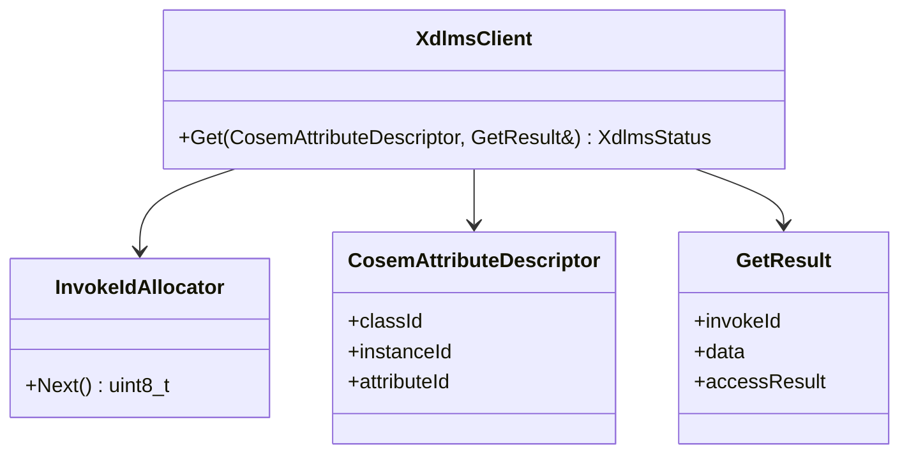

# dlms-xdlms API

## 1. Public Headers

Planned phase 1 headers:

```text
include/dlms/xdlms/xdlms_status.hpp
include/dlms/xdlms/xdlms_types.hpp
include/dlms/xdlms/xdlms_client.hpp
```

No C ABI is planned for the first implementation.

## 2. Status

`XdlmsStatus` shall be a stable status contract:

- `Ok`
- `InvalidArgument`
- `InvalidState`
- `NotAssociated`
- `SendFailed`
- `ReceiveFailed`
- `EncodeFailed`
- `DecodeFailed`
- `InvokeIdMismatch`
- `ServiceRejected`
- `BlockTransferRequired`
- `UnsupportedFeature`
- `InternalError`

## 3. Types

`CosemLogicalName` is a six-byte logical-name value.

`CosemAttributeDescriptor` contains:

- `classId`
- `instanceId`
- `attributeId`

`ServiceOptions` contains:

- `confirmed`
- `highPriority`

The default is confirmed normal priority.

`GetResult` contains:

- `invokeId`
- `hasData`
- `data`
- `hasAccessResult`
- `accessResult`

The first phase keeps `data` as encoded xDLMS data bytes. Typed COSEM data
projection belongs to later service/facade work.

## 4. Client

```cpp
dlms::xdlms::XdlmsClient client(channel, association);

dlms::xdlms::CosemAttributeDescriptor descriptor = {};
descriptor.classId = 1;
descriptor.instanceId = dlms::xdlms::CosemLogicalName(0, 0, 1, 0, 0, 255);
descriptor.attributeId = 2;

dlms::xdlms::GetResult result;
const dlms::xdlms::XdlmsStatus status = client.Get(descriptor, result);
```

`XdlmsClient` does not own the association object and does not own the profile
APDU channel. The caller must keep both alive for the client lifetime.

## 5. Module Diagram


