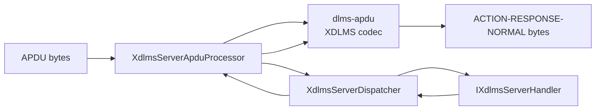
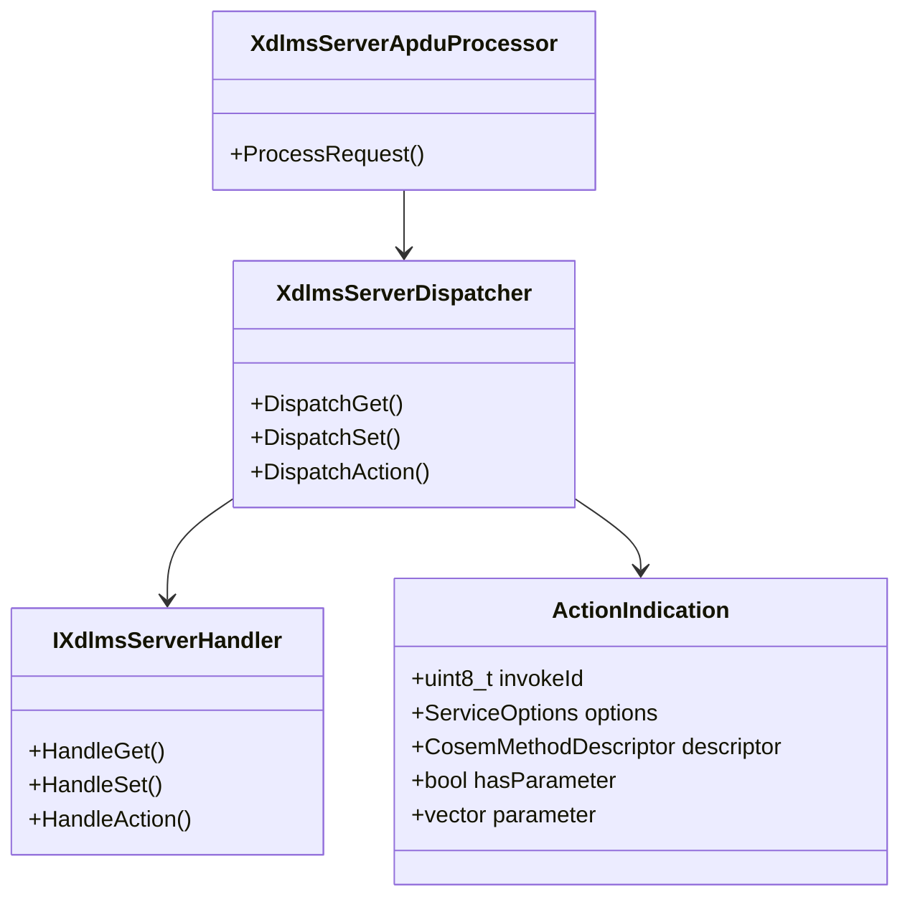

# Server ACTION APDU Boundary

## 1. Scope

This document defines the document-first boundary for server-side
`ACTION-REQUEST-NORMAL` processing in `dlms-xdlms`.

In scope:

- decode unprotected `ACTION-REQUEST-NORMAL` APDUs;
- reject unsupported ACTION request shapes;
- reject unconfirmed ACTION requests in the first implementation;
- map the method descriptor into an xDLMS server indication;
- preserve encoded invocation parameter bytes when the parameter is present;
- dispatch through `XdlmsServerDispatcher`;
- encode `ACTION-RESPONSE-NORMAL`.

Out of scope:

- ACTION with list;
- ACTION block transfer;
- ciphered APDUs;
- association negotiation;
- COSEM object method execution;
- transport I/O.

The COSEM method execution belongs to `dlms-server` and `dlms-cosem`.

## 2. API Requirements

Add `ActionIndication` to the server-side xDLMS contract:

```cpp
struct ActionIndication
{
  std::uint8_t invokeId;
  ServiceOptions options;
  CosemMethodDescriptor descriptor;
  std::vector<std::uint8_t> parameter;
  bool hasParameter;
};
```

Extend `IXdlmsServerHandler` and `XdlmsServerDispatcher`:

```cpp
virtual XdlmsStatus HandleAction(
  const ActionIndication& indication,
  ActionResult& result);

XdlmsStatus DispatchAction(
  const ActionIndication& indication,
  ActionResult& result);
```

`ActionResult` already exists on the client-facing xDLMS service model and is
reused as the server result model. The server APDU boundary shall use:

- `result.invokeId` for invoke-id/priority mirroring;
- `result.actionResult` for the ACTION result code;
- `result.hasData`, `result.data`, `result.hasAccessResult`, and
  `result.accessResult` for optional return parameter encoding.

## 3. Processing Rules

1. The APDU processor shall decode through `dlms-apdu::DecodeXdlmsApdu`.
2. Only `XdlmsApduKind::ActionRequest` with
   `ActionRequestChoice::Normal` is accepted.
3. `ServiceOptions::confirmed` must be true.
4. If the request has an invocation parameter, its `DlmsData` value shall be
   re-encoded into `ActionIndication::parameter`.
5. If the request has no invocation parameter, `hasParameter` shall be false
   and `parameter` shall be empty.
6. The dispatcher result shall be encoded as `ACTION-RESPONSE-NORMAL`.
7. Handler failures shall return the handler status and leave response bytes
   empty.

## 4. Architecture



## 5. Class Interaction



## 6. Test Plan

Unit coverage in `dlms-xdlms`:

- normal ACTION without invocation parameter returns a normal response;
- normal ACTION with invocation parameter forwards exact encoded parameter
  bytes;
- invoke-id/priority is mirrored in the response;
- action result is encoded in the response;
- optional return data is encoded when present;
- optional return access-result is encoded when present;
- unsupported request shapes are rejected;
- unconfirmed ACTION is rejected;
- handler failures leave response bytes empty.

Root integration coverage belongs in the root repository after both
`dlms-xdlms` and `dlms-server` expose the ACTION server boundary.
