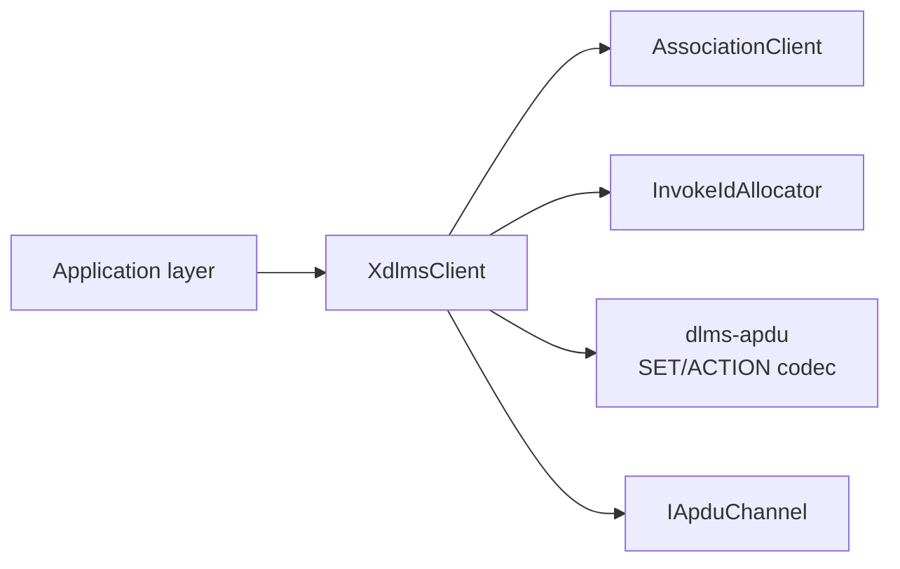
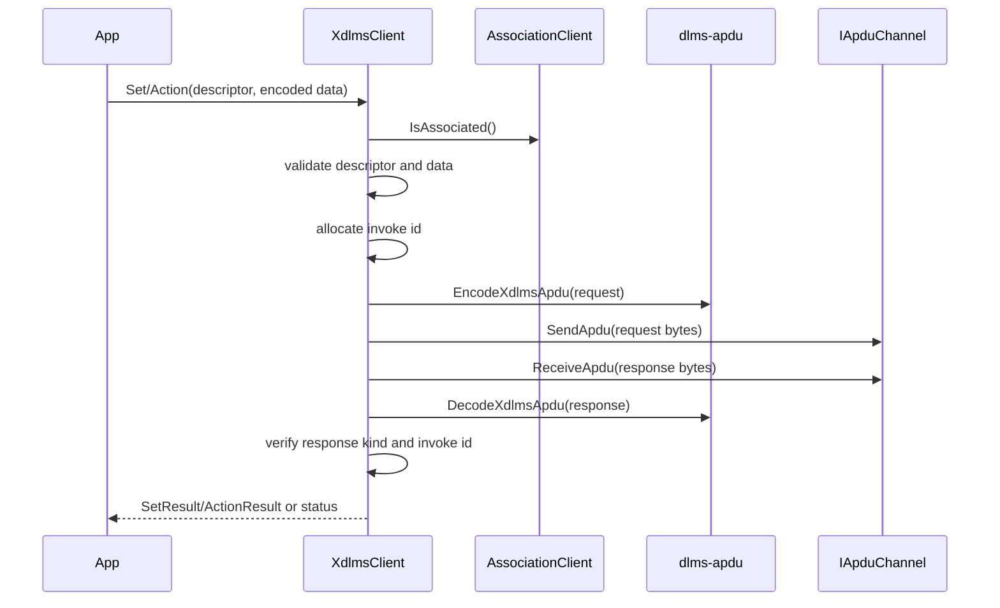
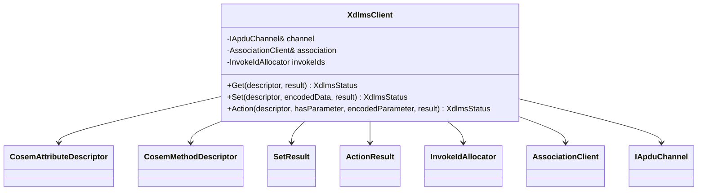

# Client SET/ACTION Boundary

## 1. Scope

This document defines the client-side normal SET and ACTION boundary for
`dlms-xdlms`.

The existing `XdlmsClient` supports confirmed normal GET over an established
association and an `IApduChannel`. This phase extends the same client with:

- confirmed `SET-REQUEST-NORMAL` / `SET-RESPONSE-NORMAL`;
- confirmed `ACTION-REQUEST-NORMAL` / `ACTION-RESPONSE-NORMAL`;
- invoke-id and priority handling consistent with the existing GET flow;
- encoded DLMS `Data` byte inputs and outputs at the public xDLMS service
  boundary.

Block transfer, WITH-LIST variants, unconfirmed SET/ACTION, selective access,
ciphering, retries, and association opening remain out of scope for this
boundary.

## 2. Requirements

`dlms-xdlms` client SET shall:

- require an established association before sending a request;
- validate `CosemAttributeDescriptor` before encoding;
- reject an empty encoded SET value before sending;
- encode only `SET-REQUEST-NORMAL`;
- mirror the allocated invoke id in the expected response;
- return service rejection details from `SET-RESPONSE-NORMAL` as
  `SetResult::accessResult`;
- reject unsupported SET response shapes as `UnsupportedFeature` or
  `BlockTransferRequired`.

`dlms-xdlms` client ACTION shall:

- require an established association before sending a request;
- validate `CosemMethodDescriptor` before encoding;
- allow an omitted invocation parameter;
- reject an empty invocation parameter when the parameter is explicitly present;
- encode only `ACTION-REQUEST-NORMAL`;
- mirror the allocated invoke id in the expected response;
- return non-zero action results through `ActionResult::actionResult`;
- preserve optional encoded return parameter bytes in `ActionResult::data`;
- reject unsupported ACTION response shapes as `UnsupportedFeature` or
  `BlockTransferRequired`.

The service-class bit of invoke-id-and-priority is set for confirmed requests,
matching the DLMS/COSEM rule that confirmed GET, SET, and ACTION services carry
service class in the invoke-id-and-priority byte.

## 3. API Contract

Extend `XdlmsClient` with two methods:

```cpp
XdlmsStatus Set(
  const CosemAttributeDescriptor& descriptor,
  const std::vector<std::uint8_t>& encodedData,
  SetResult& result);

XdlmsStatus Action(
  const CosemMethodDescriptor& descriptor,
  bool hasParameter,
  const std::vector<std::uint8_t>& encodedParameter,
  ActionResult& result);
```

`encodedData`, `encodedParameter`, and `ActionResult::data` are complete encoded
DLMS `Data` values, including the data type tag. `dlms-xdlms` does not expose
COSEM class-specific values at this layer.

Status mapping:

| Condition | Status |
|---|---|
| Invalid descriptor | `InvalidDescriptor` |
| Empty SET value | `InvalidData` |
| Present but empty ACTION parameter | `InvalidData` |
| Association is not open | `NotAssociated` |
| APDU encode failure | `EncodeFailed` |
| Channel send failure | `SendFailed` |
| Channel receive failure | `ReceiveFailed` |
| APDU decode failure or wrong response kind | `DecodeFailed` |
| Invoke id mismatch | `InvokeIdMismatch` |
| SET response with data-access-result != success | `ServiceRejected` |
| ACTION response with non-zero action-result | `ServiceRejected` |
| Response indicates block transfer | `BlockTransferRequired` |
| Unsupported response choice | `UnsupportedFeature` |

## 4. Architecture



## 5. Sequence



## 6. Class Interactions



## 7. Test Plan

Unit tests shall cover:

- SET rejects invalid descriptor;
- SET rejects empty encoded data;
- SET requires association;
- SET sends `SET-REQUEST-NORMAL` with encoded data bytes preserved;
- SET maps send, receive, decode, wrong-kind, invoke-id mismatch, access-result,
  unsupported shape, and block-transfer-required outcomes;
- ACTION rejects invalid descriptor;
- ACTION rejects present empty parameter;
- ACTION requires association;
- ACTION sends `ACTION-REQUEST-NORMAL` with optional parameter handling;
- ACTION maps send, receive, decode, wrong-kind, invoke-id mismatch, non-zero
  action-result, return parameter, unsupported shape, and
  block-transfer-required outcomes.

Root integration is deferred until the public client facade exists, because this
boundary still operates at the xDLMS service layer over a fake `IApduChannel`.
