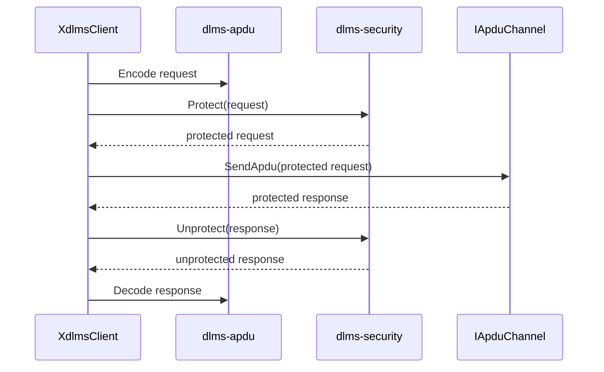
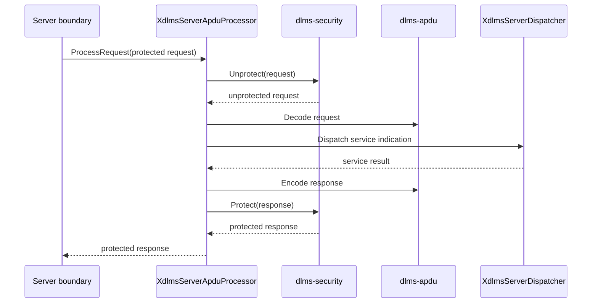

# xDLMS Security APDU Boundary

## 1. Scope

This phase connects `dlms-xdlms` to `dlms-security` at the complete APDU byte
boundary. It does not implement cryptography in this repo and does not change
association setup.

Supported boundary:

- client GET/SET/ACTION request protection;
- client GET/SET/ACTION response unprotection;
- server request unprotection before GET/SET/ACTION dispatch;
- server response protection after GET/SET/ACTION response encoding;
- no-security compatibility through existing constructors.

## 2. Rationale

Document RAG describes the protected flow as:

1. build the unprotected xDLMS service APDU;
2. build the ciphered APDU using the active security context;
3. on receive, decipher and restore the original unprotected APDU;
4. invoke the appropriate service primitive.

That maps directly to the existing `XdlmsClient` and
`XdlmsServerApduProcessor` byte boundaries.

## 3. API Contract

Existing no-security constructors remain valid:

```cpp
XdlmsClient(profile::IApduChannel& channel,
            association::AssociationClient& association);

XdlmsServerApduProcessor(XdlmsServerDispatcher& dispatcher);
```

New security constructors add a non-owning `dlms-security` processor reference:

```cpp
XdlmsClient(profile::IApduChannel& channel,
            association::AssociationClient& association,
            security::CipheredApduProcessor& security);

XdlmsServerApduProcessor(XdlmsServerDispatcher& dispatcher,
                         security::CipheredApduProcessor& security);
```

The caller owns the security context, keys, invocation counters, and system
titles. The xDLMS layer only invokes `Protect()` and `Unprotect()`.

## 4. Status Mapping

`SecurityStatus::Ok` maps to `XdlmsStatus::Ok`.

All failed protect/unprotect paths map to `XdlmsStatus::SecurityFailed`, except
`InvalidArgument`, which may map to `InvalidArgument` when the xDLMS caller
supplied an invalid local argument before security processing begins.

Security failures include missing keys, invalid key length, invalid context,
invalid system title, authentication failure, cipher/decipher failure, replay
detection, invocation counter exhaustion, and output buffer failures.

## 5. Client Flow



## 6. Server Flow



## 7. Test Plan

Tests shall verify:

- unprotected constructors keep current behavior;
- protected client GET request is not sent as a raw GET APDU;
- protected client response is unprotected before decode;
- protected server request is unprotected before handler dispatch;
- protected server response is not returned as a raw response APDU;
- authentication or replay failure returns `SecurityFailed`;
- failed security processing leaves output response bytes empty.
