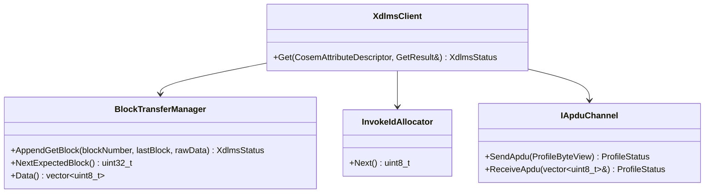
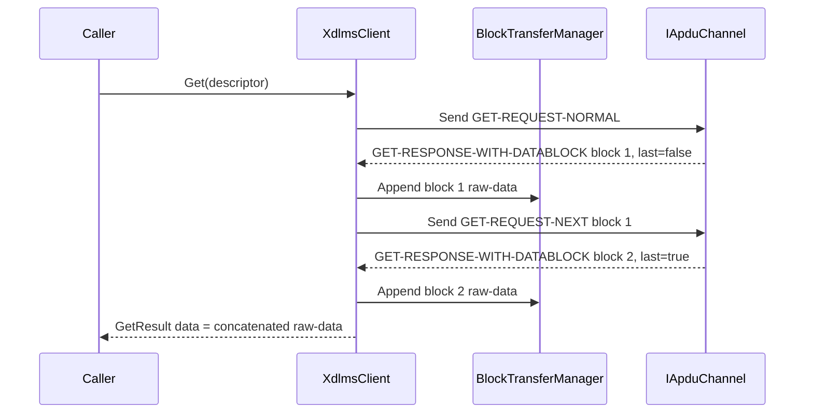

# xDLMS Block Transfer Plan

## 1. Scope

This document defines the next xDLMS implementation boundary for
service-specific block transfer.

The first implementation increment shall cover client-side GET response block
transfer:

- server returns `GET-RESPONSE-WITH-DATABLOCK` with `Last_Block = false`;
- client sends `GET-REQUEST-NEXT` with the latest accepted block number;
- client appends raw-data blocks until the last block is received;
- final output is exposed through the existing `GetResult::data` field.

Future increments shall cover:

- server-side GET datablock response production;
- SET request block transfer from client to server;
- ACTION request or response block transfer where APDU support exists.

Out of scope for the first increment:

- GET-WITH-LIST;
- selective access;
- SET-WITH-FIRST-DATABLOCK and SET-WITH-DATABLOCK;
- ACTION block transfer;
- multiple concurrent block transfers;
- persistence or retry policy outside one synchronous service call.

## 2. Requirements

Document RAG alignment:

- Green Book edition 8.3 describes confirmed GET with block transfer as an
  initial normal GET followed by one or more `GET-REQUEST-NEXT` exchanges.
- Each response datablock carries `Last_Block`, `Block_Number`, and `Raw_Data`.
- The client requests the next GET block using the latest correctly received
  block number.
- SET block transfer is a different flow: the client sends request data blocks
  and the server acknowledges each accepted block.
- Throughout a long SET transfer, the invoke id and priority remain the same.

Rules for the first GET increment:

1. The client shall keep one active block transfer per service call.
2. A normal GET response with data shall keep the current behavior unchanged.
3. A first GET datablock response shall no longer return
   `BlockTransferRequired` when automatic block transfer is enabled.
4. The client shall append every datablock `Raw_Data` in block-number order.
5. The client shall send `GET-REQUEST-NEXT` with the latest accepted block
   number while `Last_Block = false`.
6. A repeated, skipped, or unexpected block number shall map to
   `DecodeFailed`.
7. Send and receive failures during the block sequence shall map to existing
   `SendFailed` and `ReceiveFailed` statuses.
8. A malformed `GET-RESPONSE-WITH-DATABLOCK` shall map to `DecodeFailed`.
9. Security, when configured, shall protect every `GET-REQUEST-NEXT` and
   unprotect every datablock response at the same xDLMS APDU boundary as
   normal GET.
10. The first increment shall not add transport retry or timeout policy.

## 3. API Contract

`ServiceOptions` gains an implementation-owned block-transfer setting:

```cpp
struct ServiceOptions {
  bool confirmed;
  bool highPriority;
  bool allowBlockTransfer;
  std::size_t maxBlockTransferBytes;
};
```

Defaults:

- `allowBlockTransfer = true`;
- `maxBlockTransferBytes` is finite and documented by the implementation.

`XdlmsClient::Get()` keeps its public shape. When block transfer completes
successfully, `GetResult::data` contains the concatenated encoded xDLMS raw data
bytes carried by the response blocks.

`BlockTransferRequired` remains the status for unsupported block forms or when
automatic block transfer is explicitly disabled.

## 4. Architecture



## 5. GET Sequence



## 6. Test Plan

Client unit tests:

- normal GET response still returns one-block data unchanged;
- first datablock plus final datablock returns concatenated data;
- generated `GET-REQUEST-NEXT` carries the latest received block number;
- send failure during `GET-REQUEST-NEXT` maps to `SendFailed`;
- receive failure during a following datablock maps to `ReceiveFailed`;
- malformed datablock maps to `DecodeFailed`;
- repeated or skipped block number maps to `DecodeFailed`;
- disabled automatic block transfer maps the first datablock to
  `BlockTransferRequired`;
- secure client protects every `GET-REQUEST-NEXT` and unprotects every
  datablock response.

Server and SET/ACTION tests are deferred until their implementation phases.

## 7. Implementation Phases

### Phase 23. Block Transfer Documentation

Deliverables:

- block-transfer requirements;
- API contract for client GET block transfer options;
- architecture and GET sequence diagrams;
- unit test plan;
- implementation phase split.

Commit message:

```text
docs(xdlms): define get block transfer
```

### Phase 24. Client GET Block Transfer

Deliverables:

- `BlockTransferManager` for GET response blocks;
- GET-RESPONSE-WITH-DATABLOCK decode path in `XdlmsClient`;
- GET-REQUEST-NEXT encode loop;
- block-number validation and max-size guard;
- focused client unit tests.

Commit message:

```text
feat(xdlms): handle get response blocks
```

### Phase 25. Root Integration Update

Deliverables:

- root submodule pointer update;
- root integration test for multi-block GET over a fake APDU channel;
- full root build and test run.

Commit message:

```text
test: cover xdlms get block transfer
```
