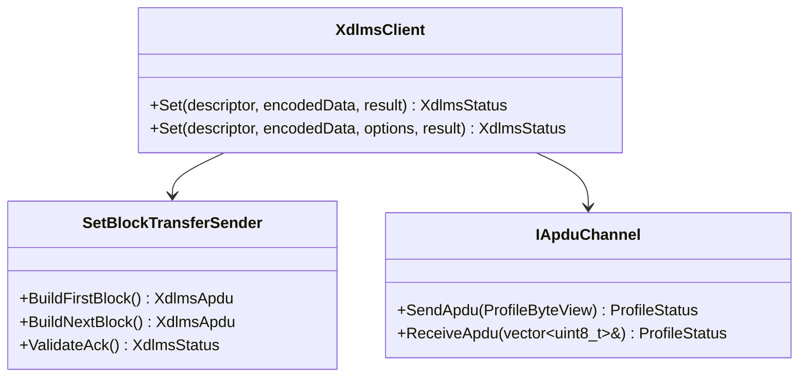
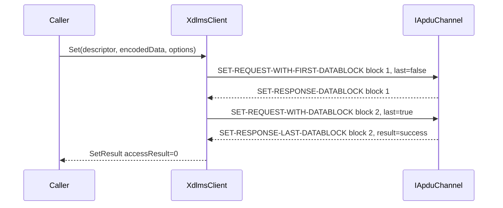

# xDLMS SET Block Transfer Plan

## 1. Scope

This document defines the next xDLMS implementation boundary for client-side
SET request block transfer.

The implementation shall cover a single confirmed LN SET of one attribute when
the encoded xDLMS `Data` value is sent as service-specific SET blocks:

- `SET-REQUEST-WITH-FIRST-DATABLOCK` carries the attribute descriptor and block
  1 raw data;
- the server acknowledges non-final blocks with `SET-RESPONSE-DATABLOCK`;
- the client sends following `SET-REQUEST-WITH-DATABLOCK` APDUs;
- the final request block has `Last_Block = true`;
- the server returns `SET-RESPONSE-LAST-DATABLOCK` with the final access
  result and acknowledged block number.

Out of scope for this increment:

- SET-WITH-LIST and SET-WITH-LIST-AND-FIRST-DATABLOCK;
- server-side SET block reassembly;
- ACTION block transfer;
- retry and timeout policy;
- multiple concurrent long SET transfers;
- splitting by negotiated APDU size from association context.

## 2. Requirements

Document RAG alignment:

- Green Book edition 8.3 describes long SET as FIRST-BLOCK followed by
  ONE-BLOCK requests and a final LAST-BLOCK request.
- The server acknowledges each received non-final block with ACK-BLOCK and the
  same block number as the accepted request block.
- The final response carries the result of the complete SET invocation and the
  last accepted block number.
- The invoke id and priority remain the same throughout the long transfer.
- A wrong next block number aborts the server-side transfer.

Rules:

1. Normal one-APDU SET shall keep the existing behavior.
2. Blocked SET shall be opt-in through `ServiceOptions`.
3. The first block shall be sent as `SetRequestChoice::WithFirstDataBlock`.
4. Following blocks shall be sent as `SetRequestChoice::WithDataBlock`.
5. The first and following requests shall reuse the same invoke-id-and-priority
   byte.
6. Each non-final server response shall be `SetResponseChoice::DataBlock` and
   shall acknowledge the just-sent block number.
7. The final server response shall be `SetResponseChoice::LastDataBlock`.
8. A response invoke-id mismatch shall map to `InvokeIdMismatch`.
9. A response block-number mismatch shall map to `DecodeFailed`.
10. A final non-zero access result shall map to `ServiceRejected`.
11. Send and receive failures shall use existing `SendFailed` and
    `ReceiveFailed` statuses.
12. Security, when configured, shall protect every SET block request and
    unprotect every SET block response at the existing xDLMS APDU boundary.

## 3. API Contract

`ServiceOptions` gains SET-specific block controls:

```cpp
struct ServiceOptions {
  bool confirmed;
  bool highPriority;
  bool allowBlockTransfer;
  std::size_t maxBlockTransferBytes;
  std::size_t maxSetBlockPayloadBytes;
};
```

Defaults:

- `allowBlockTransfer = true`;
- `maxSetBlockPayloadBytes` is finite and non-zero.

`XdlmsClient::Set()` keeps its current default public shape. An overload accepts
`ServiceOptions` for tests and callers that need to disable block transfer or
choose a smaller block payload:

```cpp
XdlmsStatus Set(
  const CosemAttributeDescriptor& descriptor,
  const std::vector<std::uint8_t>& encodedData,
  const ServiceOptions& options,
  SetResult& result);
```

When blocked SET completes successfully, `SetResult::invokeId` and
`SetResult::accessResult` are filled from the final response.

## 4. Architecture



## 5. SET Sequence



## 6. Test Plan

Client unit tests:

- normal SET response still uses the existing single-APDU path;
- blocked SET sends first and final blocks with the same invoke id and priority;
- non-final ACK block number must match the just-sent block;
- final last-datablock response fills `SetResult`;
- final non-zero access result maps to `ServiceRejected`;
- disabled block transfer maps oversized SET data to `BlockTransferRequired`;
- send and receive failures during any block map to existing statuses;
- secure client protects every SET block request and unprotects every SET block
  response.

Root integration:

- add a fake-channel multi-block SET acceptance test after the xDLMS unit phase.

## 7. Implementation Phases

### Phase 26. SET Block Transfer Documentation

Deliverables:

- SET block-transfer requirements;
- API contract for SET block service options;
- architecture and sequence diagrams;
- focused unit and root test plan.

Commit message:

```text
docs(xdlms): define set block transfer
```

### Phase 27. Client SET Block Transfer

Deliverables:

- options-aware `XdlmsClient::Set` overload;
- SET block request generation;
- ACK and final-response validation;
- focused unit tests.

Commit message:

```text
feat(xdlms): send set request blocks
```

### Phase 28. Root Integration Update

Deliverables:

- root submodule pointer update;
- root integration test for multi-block SET over a fake APDU channel;
- full root build and test run.

Commit message:

```text
test: cover xdlms set block transfer
```

### Phase 38. Server SET Request Blocks

Detailed in [13_server_set_request_blocks_plan.md](13_server_set_request_blocks_plan.md).
