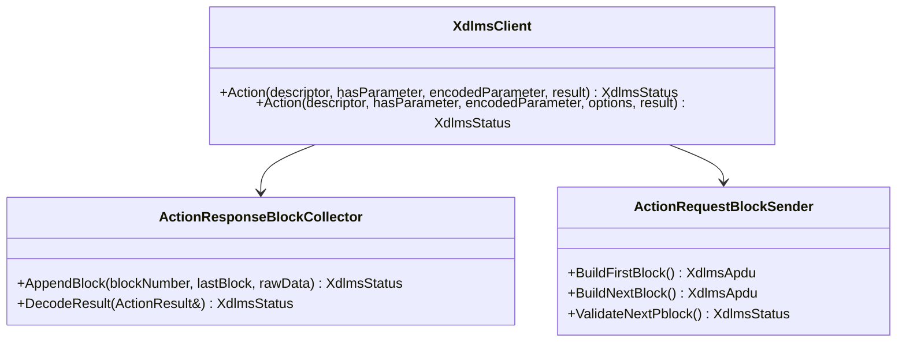
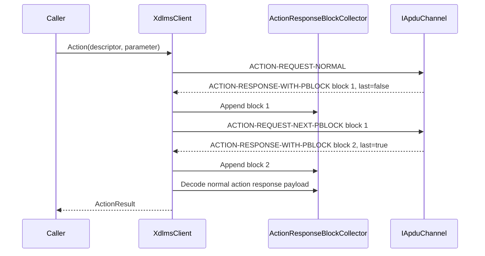

# xDLMS ACTION Block Transfer Plan

## 1. Scope

This document defines the future xDLMS implementation boundary for
service-specific ACTION block transfer.

ACTION is deliberately documented separately from GET and SET because the
service has two block-transfer directions:

- request-side block transfer for method invocation parameters that do not fit
  in one APDU;
- response-side block transfer for return parameters that do not fit in one
  APDU.

The first implementation increment should cover response-side ACTION blocks for
single-method ACTION, because it matches the already implemented GET response
block collection model more closely.

Out of scope for the first ACTION increment:

- ACTION-WITH-LIST;
- general block transfer;
- server-side ACTION request block reassembly;
- multiple concurrent ACTION transfers;
- retry and timeout policy;
- negotiated APDU-size splitting.

## 2. Requirements

Document RAG alignment:

- Green Book edition 8.3 describes ACTION as a two-phase service.
- If method references and invocation parameters do not fit in one APDU, they
  may be sent with service-specific request blocks.
- If return parameters do not fit in one APDU, the response may be sent with
  service-specific response blocks.
- `ACTION-REQUEST-NEXT-PBLOCK` carries the latest response block number
  correctly received from the server.
- `ACTION-RESPONSE-NEXT-PBLOCK` carries the latest request block number
  correctly received from the client.
- For single-method response block transfer, raw data carries the action result
  and optional response parameter bytes.

Rules for the first response-side increment:

1. Normal one-APDU ACTION keeps the current behavior.
2. `ACTION-RESPONSE-WITH-PBLOCK` with `Last_Block = false` starts a synchronous
   response block sequence inside `XdlmsClient::Action`.
3. The client sends `ACTION-REQUEST-NEXT-PBLOCK` with the latest accepted
   response block number.
4. Raw-data blocks are concatenated until `Last_Block = true`.
5. The concatenated raw-data is decoded as the normal single-method ACTION
   response payload.
6. Block numbers must be sequential and must not repeat.
7. Response invoke-id mismatch maps to `InvokeIdMismatch`.
8. Malformed, repeated, skipped, or unsupported blocks map to `DecodeFailed`.
9. Security, when configured, protects every next-pblock request and unprotects
   every pblock response at the existing xDLMS APDU boundary.

Rules for a later request-side increment:

1. Oversized invocation parameters are sent with
   `ACTION-REQUEST-WITH-FIRST-PBLOCK` followed by `ACTION-REQUEST-WITH-PBLOCK`.
2. Non-final server responses are `ACTION-RESPONSE-NEXT-PBLOCK` and acknowledge
   the latest accepted request block number.
3. Once the last request block is accepted, normal or response-side pblock
   handling processes the method result.

## 3. API Contract

`ServiceOptions` should gain ACTION-specific payload controls:

```cpp
struct ServiceOptions {
  bool confirmed;
  bool highPriority;
  bool allowBlockTransfer;
  std::size_t maxBlockTransferBytes;
  std::size_t maxSetBlockPayloadBytes;
  std::size_t maxActionBlockPayloadBytes;
};
```

`XdlmsClient::Action()` should keep its current default public shape and gain
an options-aware overload:

```cpp
XdlmsStatus Action(
  const CosemMethodDescriptor& descriptor,
  bool hasParameter,
  const std::vector<std::uint8_t>& encodedParameter,
  const ServiceOptions& options,
  ActionResult& result);
```

`BlockTransferRequired` remains the status for unsupported ACTION block forms
or when block transfer is disabled.

## 4. Architecture



## 5. Response-Side Sequence



## 6. Test Plan

Response-side client unit tests:

- normal ACTION remains unchanged;
- first pblock plus final pblock returns decoded action result;
- generated `ACTION-REQUEST-NEXT-PBLOCK` carries the latest received response
  block number;
- repeated or skipped response block maps to `DecodeFailed`;
- response invoke-id mismatch maps to `InvokeIdMismatch`;
- disabled block transfer maps first response pblock to
  `BlockTransferRequired`;
- secure client protects every next-pblock request and unprotects every pblock
  response.

Request-side tests are deferred until request-side implementation.

## 7. Implementation Phases

### Phase 29. ACTION Block Transfer Documentation

Deliverables:

- ACTION block-transfer requirements;
- API contract for future ACTION block service options;
- architecture and sequence diagrams;
- response-side and request-side phase split.

Commit message:

```text
docs(xdlms): define action block transfer
```

### Phase 30. Client ACTION Response Blocks

Deliverables:

- options-aware `XdlmsClient::Action` overload;
- ACTION-RESPONSE-WITH-PBLOCK collection;
- ACTION-REQUEST-NEXT-PBLOCK encode loop;
- normal single-method action response payload decode;
- focused client unit tests.

Commit message:

```text
feat(xdlms): handle action response blocks
```

### Phase 31. Root Integration Update

Deliverables:

- root submodule pointer update;
- root integration test for multi-block ACTION response over a fake APDU
  channel;
- full root build and test run.

Commit message:

```text
test: cover xdlms action response block transfer
```

### Phase 32. Client ACTION Request Blocks

Detailed in [11_action_request_block_transfer_plan.md](11_action_request_block_transfer_plan.md).
