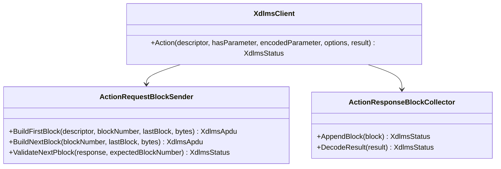
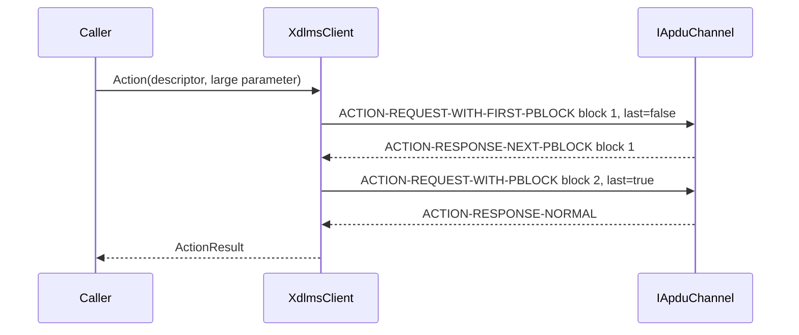

# xDLMS ACTION Request Block Transfer Plan

## 1. Scope

This document defines the next ACTION block-transfer increment:
client-side sending of oversized single-method invocation parameters.

The previous ACTION increment implemented response-side pblock collection.
This increment adds the opposite direction only:

- the client splits an oversized encoded invocation parameter into
  service-specific ACTION request pblocks;
- the server acknowledges non-final request blocks with
  `ACTION-RESPONSE-NEXT-PBLOCK`;
- the final request block is followed by a normal ACTION response or by the
  already implemented response-side pblock sequence.

Out of scope:

- ACTION-WITH-LIST and WITH-LIST-AND-FIRST-PBLOCK;
- server-side ACTION request block reassembly;
- negotiated APDU-size driven splitting;
- retry policy;
- concurrent block transfers.

## 2. Requirements

Client request-side rules:

1. Normal ACTION remains the default when there is no invocation parameter or
   the encoded invocation parameter fits `maxActionBlockPayloadBytes`.
2. If `hasParameter == true` and the encoded parameter is larger than
   `maxActionBlockPayloadBytes`, the client uses request block transfer.
3. `allowBlockTransfer == false` maps oversized parameters to
   `BlockTransferRequired` before sending an ACTION APDU.
4. `maxActionBlockPayloadBytes == 0` with an oversized parameter maps to
   `InvalidArgument`.
5. Block 1 is sent as `ACTION-REQUEST-WITH-FIRST-PBLOCK` and carries the COSEM
   method descriptor plus `DataBlockSA`.
6. Blocks 2..N are sent as `ACTION-REQUEST-WITH-PBLOCK` and carry only
   `DataBlockSA`.
7. Non-final server acknowledgements must be
   `ACTION-RESPONSE-NEXT-PBLOCK` with the same invoke id and the expected block
   number.
8. The final server response may be:
   - `ACTION-RESPONSE-NORMAL`, decoded through the existing normal result path;
   - `ACTION-RESPONSE-WITH-PBLOCK`, decoded through the existing response-side
     pblock collector.
9. ACK mismatch, skipped ACKs, wrong response kind, or unsupported ACTION
   response choices map to `DecodeFailed`.
10. Invoke-id mismatch maps to `InvokeIdMismatch`.
11. Security, when configured, protects every request pblock and unprotects
    every response at the existing xDLMS APDU boundary.

## 3. API Contract

`ServiceOptions` gains an ACTION request block payload limit:

```cpp
struct ServiceOptions {
  bool confirmed;
  bool highPriority;
  bool allowBlockTransfer;
  std::size_t maxBlockTransferBytes;
  std::size_t maxSetBlockPayloadBytes;
  std::size_t maxActionBlockPayloadBytes;
};
```

Default:

```cpp
maxActionBlockPayloadBytes = 1024;
```

The existing options-aware `Action` overload is used:

```cpp
XdlmsStatus Action(
  const CosemMethodDescriptor& descriptor,
  bool hasParameter,
  const std::vector<std::uint8_t>& encodedParameter,
  const ServiceOptions& options,
  ActionResult& result);
```

No new public result type is required.

## 4. Architecture



## 5. Sequence



Final response-side pblocks reuse the Phase 30 response collector after the
last request block is accepted.

## 6. Test Plan

Unit tests:

- oversized ACTION parameter sends first and next request pblocks;
- first request pblock includes the method descriptor and block 1 bytes;
- next request pblocks contain only `DataBlockSA`;
- non-final `ACTION-RESPONSE-NEXT-PBLOCK` ACK is validated;
- final normal ACTION response is mapped to `ActionResult`;
- final `ACTION-RESPONSE-WITH-PBLOCK` is collected by the existing response
  block path;
- disabled block transfer maps to `BlockTransferRequired`;
- zero action block payload limit maps to `InvalidArgument`;
- ACK block mismatch maps to `DecodeFailed`;
- ACK invoke-id mismatch maps to `InvokeIdMismatch`.

Root integration test:

- associated client sends a large method parameter through multiple ACTION
  request pblocks and receives a normal final ACTION response.

## 7. Implementation Phases

### Phase 32. ACTION Request Block Documentation

Commit message:

```text
docs(xdlms): define action request blocks
```

### Phase 33. Client ACTION Request Blocks

Commit message:

```text
feat(xdlms): send action request blocks
```

### Phase 34. Root Integration Update

Commit message:

```text
test: cover xdlms action request blocks
```
