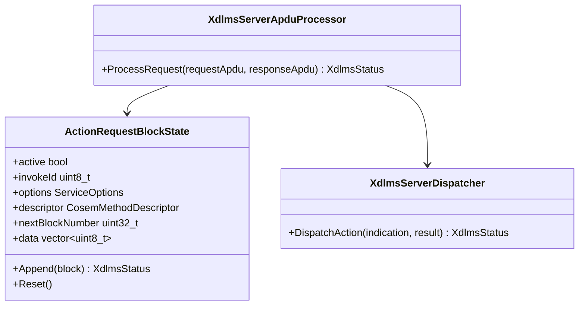
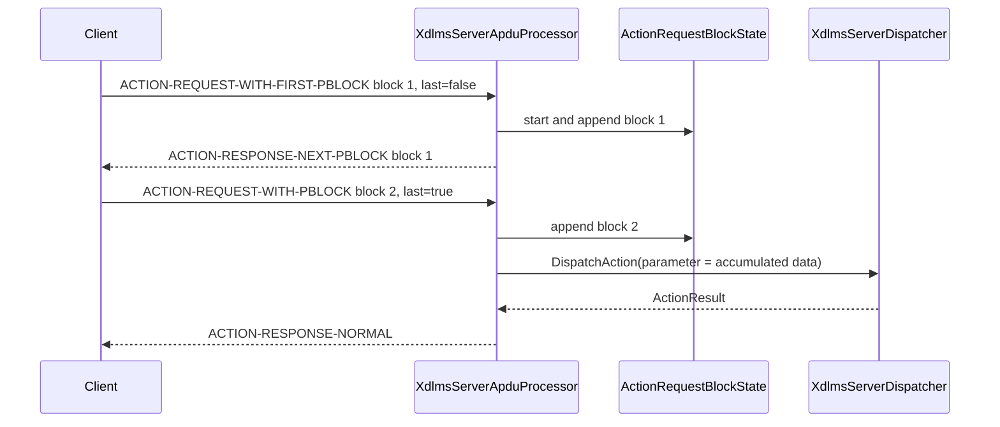

# xDLMS Server ACTION Request Block Reassembly Plan

## 1. Scope

This document defines server-side reassembly for service-specific ACTION
request pblocks.

The increment complements client-side ACTION request block sending:

- `XdlmsServerApduProcessor` accepts
  `ACTION-REQUEST-WITH-FIRST-PBLOCK`;
- it acknowledges non-final request blocks with
  `ACTION-RESPONSE-NEXT-PBLOCK`;
- it accepts following `ACTION-REQUEST-WITH-PBLOCK` messages with the same
  invoke id;
- it concatenates the raw invocation-parameter bytes;
- once the last request block arrives, it dispatches a normal
  `ActionIndication` and returns the normal ACTION response.

Out of scope:

- ACTION-WITH-LIST and WITH-LIST-AND-FIRST-PBLOCK;
- response-side server block splitting;
- general block transfer;
- retry and timeout policy;
- concurrent ACTION block transfers in a single processor instance.

## 2. Requirements

1. Normal ACTION request processing remains unchanged.
2. `ACTION-REQUEST-WITH-FIRST-PBLOCK` starts a single in-progress ACTION
   request block sequence.
3. The first pblock carries the COSEM method descriptor and block 1 raw data.
4. Non-final first/following pblocks return `ACTION-RESPONSE-NEXT-PBLOCK`
   acknowledging the latest accepted request block number.
5. Following pblocks must use the same invoke id as the active sequence.
6. Block numbers must be sequential and start at 1.
7. The accumulated raw data must not exceed `maxBlockTransferBytes`.
8. When the final pblock arrives, the accumulated raw data is decoded as one
   DLMS `Data` value and forwarded as `ActionIndication::parameter`.
9. The final handler result is encoded with the existing normal ACTION response
   path.
10. Malformed blocks, skipped blocks, duplicate blocks, missing active sequence,
    unsupported choices, or oversized accumulated payloads map to
    `DecodeFailed`.
11. Invoke-id mismatches map to `InvokeIdMismatch`.
12. Security, when configured, unprotects every request pblock and protects
    every response/ack at the existing xDLMS APDU boundary.

## 3. API Contract

No new public server API is required.

`XdlmsServerApduProcessor` becomes stateful for one active ACTION request block
sequence:

```cpp
class XdlmsServerApduProcessor {
public:
  XdlmsStatus ProcessRequest(
    const std::vector<std::uint8_t>& requestApdu,
    std::vector<std::uint8_t>& responseApdu);

private:
  ActionRequestBlockState actionBlocks_;
};
```

The state belongs to the processor instance. Embedders that need independent
sessions must use independent processor instances.

## 4. Architecture



## 5. Sequence



## 6. Test Plan

Unit tests:

- normal ACTION request still dispatches unchanged;
- first non-final pblock returns `ACTION-RESPONSE-NEXT-PBLOCK`;
- final following pblock dispatches one `ActionIndication` with concatenated
  encoded parameter bytes;
- final first pblock dispatches immediately;
- following pblock without active state maps to `DecodeFailed`;
- skipped or duplicate block number maps to `DecodeFailed`;
- invoke-id mismatch maps to `InvokeIdMismatch`;
- accumulated size over `maxBlockTransferBytes` maps to `DecodeFailed`;
- active state resets after final success and after decode failure;
- secure APDU processor unprotects each request block and protects each ack or
  final response.

Root integration test:

- xDLMS client sends ACTION request pblocks into a server APDU processor over a
  fake APDU channel and receives a normal ACTION response.

## 7. Implementation Phases

### Phase 35. Server ACTION Request Block Documentation

Commit message:

```text
docs(xdlms): define server action request blocks
```

### Phase 36. Server ACTION Request Block Reassembly

Commit message:

```text
feat(xdlms): reassemble server action request blocks
```

### Phase 37. Root Integration Update

Commit message:

```text
test: cover server action request block integration
```
