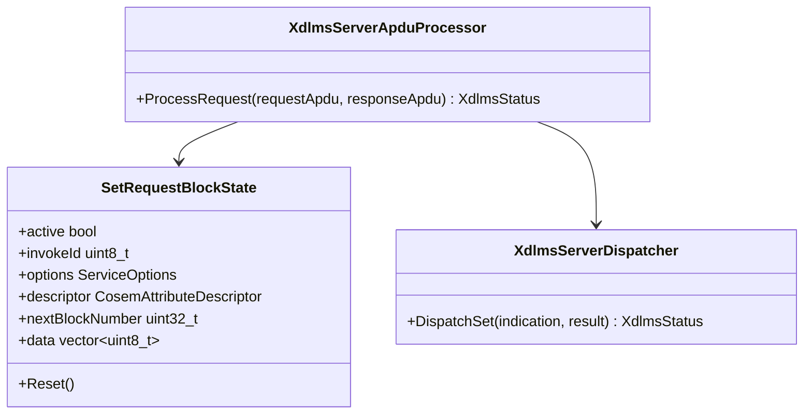
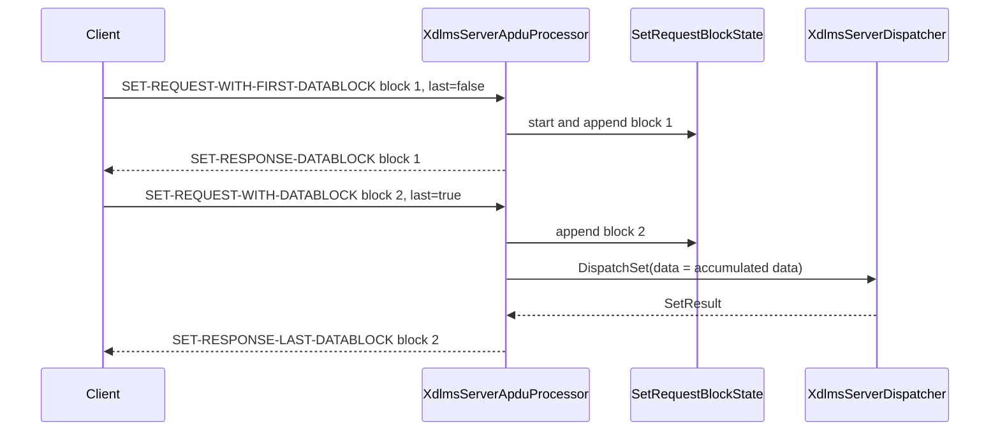

# xDLMS Server SET Request Block Reassembly Plan

## 1. Scope

This document defines server-side reassembly for service-specific SET request
data blocks.

The increment complements the existing client-side SET block sender:

- `XdlmsServerApduProcessor` accepts `SET-REQUEST-WITH-FIRST-DATABLOCK`;
- it acknowledges non-final request blocks with `SET-RESPONSE-DATABLOCK`;
- it accepts following `SET-REQUEST-WITH-DATABLOCK` messages with the same
  invoke id;
- it concatenates raw data bytes;
- once the final request block arrives, it dispatches a normal `SetIndication`;
- it returns `SET-RESPONSE-LAST-DATABLOCK` with the final access result and the
  last accepted block number.

Out of scope:

- SET-WITH-LIST and SET-WITH-LIST-AND-FIRST-DATABLOCK;
- selective access for blocked SET;
- general block transfer;
- retry and timeout policy;
- concurrent SET block transfers in one processor instance.

## 2. Requirements

1. Normal SET request processing remains unchanged.
2. `SET-REQUEST-WITH-FIRST-DATABLOCK` starts one in-progress SET request block
   sequence.
3. The first block carries the COSEM attribute descriptor and block 1 raw data.
4. Non-final first/following blocks return `SET-RESPONSE-DATABLOCK`
   acknowledging the latest accepted request block number.
5. Following blocks must use the same invoke id as the active sequence.
6. Block numbers must be sequential and start at 1.
7. The accumulated raw data must not exceed `maxBlockTransferBytes`.
8. When the final block arrives, accumulated raw data is validated as one
   encoded DLMS `Data` value and forwarded as `SetIndication::data`.
9. The final handler result is encoded as `SET-RESPONSE-LAST-DATABLOCK` with
   the final block number and access result.
10. Malformed blocks, skipped blocks, duplicate blocks, missing active
    sequence, unsupported choices, or oversized accumulated payloads map to
    `DecodeFailed`.
11. Invoke-id mismatches map to `InvokeIdMismatch`.
12. Security, when configured, unprotects every request block and protects
    every acknowledgement or final response at the existing xDLMS APDU
    boundary.

## 3. API Contract

No new public server API is required.

`XdlmsServerApduProcessor` becomes stateful for one active SET request block
sequence, independently from the existing ACTION block state:

```cpp
class XdlmsServerApduProcessor {
private:
  SetRequestBlockState setBlocks_;
  ActionRequestBlockState actionBlocks_;
};
```

The state belongs to the processor instance. Embedders that need independent
sessions must use independent processor instances.

## 4. Architecture



## 5. Sequence



## 6. Test Plan

Unit tests:

- normal SET request still dispatches unchanged;
- first non-final data block returns `SET-RESPONSE-DATABLOCK`;
- final following data block dispatches one `SetIndication` with concatenated
  encoded data bytes;
- final first data block dispatches immediately and returns
  `SET-RESPONSE-LAST-DATABLOCK`;
- following data block without active state maps to `DecodeFailed`;
- skipped or duplicate block number maps to `DecodeFailed`;
- invoke-id mismatch maps to `InvokeIdMismatch`;
- accumulated size over `maxBlockTransferBytes` maps to `DecodeFailed`;
- active state resets after final success and after decode failure;
- secure APDU processor unprotects each request block and protects each ack or
  final response.

Root integration test:

- xDLMS client sends SET request data blocks into a server APDU processor over a
  fake APDU channel and receives a final SET access result.

## 7. Implementation Phases

### Phase 38. Server SET Request Block Documentation

Commit message:

```text
docs(xdlms): define server set request blocks
```

### Phase 39. Server SET Request Block Reassembly

Commit message:

```text
feat(xdlms): reassemble server set request blocks
```

### Phase 40. Root Integration Update

Commit message:

```text
test: cover server set request block integration
```
