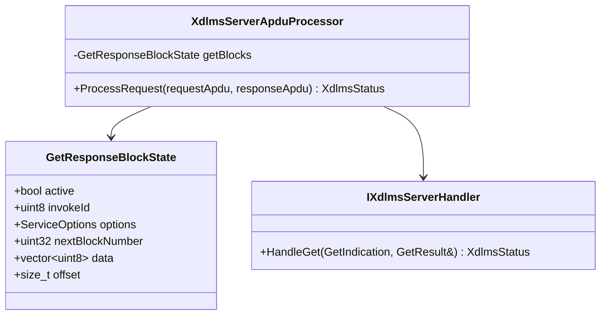
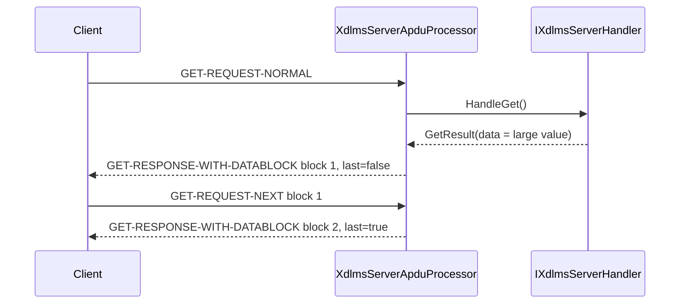

# Server GET Response Block Plan

## 1. Scope

This phase adds server-side GET response block transfer to
`XdlmsServerApduProcessor`.

In scope:

- split oversized successful GET data responses into
  `GET-RESPONSE-WITH-DATABLOCK`;
- store one active GET response block sequence per APDU processor instance;
- handle `GET-REQUEST-NEXT` for the active sequence;
- preserve invoke id and priority across all response blocks;
- enforce total and per-block size limits from `ServiceOptions`;
- keep normal GET data and data-access-result responses unchanged.

Out of scope:

- GET-WITH-LIST;
- selective access;
- retry policy;
- multiple concurrent GET block transfers on one processor;
- persistent block state outside one association/session processor.

## 2. Requirements

1. A normal successful GET whose encoded data length is less than or equal to
   `maxGetBlockPayloadBytes` shall still return `GET-RESPONSE-NORMAL`.
2. A larger successful GET shall return the first
   `GET-RESPONSE-WITH-DATABLOCK` with block number `1`.
3. The processor shall remember the remaining response bytes until the final
   block is sent or an error resets the active state.
4. `GET-REQUEST-NEXT` shall carry the last block number accepted by the
   client. The server shall return the following block.
5. A wrong invoke id, missing active sequence, skipped block, or duplicate
   block shall map to `DecodeFailed` or `InvokeIdMismatch` as appropriate.
6. Data-access-result GET responses shall not use block transfer.
7. If the successful data response exceeds `maxBlockTransferBytes`, processing
   shall fail with `DecodeFailed`.
8. If `allowBlockTransfer` is false and a successful data response needs more
   than one response APDU, processing shall return `BlockTransferRequired`.
9. A zero `maxGetBlockPayloadBytes` for an oversized response shall return
   `InvalidArgument`.
10. Secure APDU processing shall protect every response block and unprotect
    every `GET-REQUEST-NEXT` request at the existing security boundary.

## 3. API Contract

`ServiceOptions` gains a GET response payload limit:

```cpp
struct ServiceOptions {
  bool confirmed;
  bool highPriority;
  bool allowBlockTransfer;
  std::size_t maxBlockTransferBytes;
  std::size_t maxGetBlockPayloadBytes;
  std::size_t maxSetBlockPayloadBytes;
  std::size_t maxActionBlockPayloadBytes;
};
```

Defaults:

- `allowBlockTransfer = true`;
- `maxBlockTransferBytes` is the maximum collected payload for one service;
- `maxGetBlockPayloadBytes` is finite and non-zero.

The handler API does not change. `IXdlmsServerHandler::HandleGet()` still
returns a complete successful `GetResult::data` buffer. The APDU processor owns
the response block splitting. Options-aware `XdlmsServerApduProcessor`
constructors set the server-side block limits for all requests handled by that
processor instance.

## 4. Architecture



The state belongs to the APDU processor because it is association/session
scoped, like existing SET and ACTION request block reassembly state.

## 5. Sequence



## 6. Test Plan

Server APDU tests:

- small successful GET still encodes `GET-RESPONSE-NORMAL`;
- large successful GET emits first data block and then final block on
  `GET-REQUEST-NEXT`;
- block payload size follows `maxGetBlockPayloadBytes`;
- wrong `GET-REQUEST-NEXT` block number maps to `DecodeFailed`;
- wrong invoke id maps to `InvokeIdMismatch`;
- `GET-REQUEST-NEXT` without active state maps to `DecodeFailed`;
- data-access-result responses remain normal responses;
- disabled block transfer maps oversized successful data to
  `BlockTransferRequired`;
- zero GET block payload limit maps oversized successful data to
  `InvalidArgument`;
- active state resets after final block and after failures.

Root integration:

- client GET consumes server response blocks over the fake APDU channel and
  returns concatenated data bytes;
- full root build and test run remains green.

## 7. Implementation Phases

### Phase 41. Server GET Response Block Documentation

Deliverables:

- server GET response block requirements;
- `maxGetBlockPayloadBytes` API contract;
- APDU processor state and sequence diagrams;
- unit and root integration test plan.

Commit message:

```text
docs(xdlms): define server get response blocks
```

### Phase 42. Server GET Response Block Implementation

Deliverables:

- `GetResponseBlockState`;
- first response block generation for oversized successful GET data;
- `GET-REQUEST-NEXT` handling;
- state reset on final block and failure;
- focused server APDU tests.

Commit message:

```text
feat(xdlms): send server get response blocks
```

### Phase 43. Root Integration Update

Deliverables:

- root submodule pointer update;
- root integration test for blocked GET response through client/server APDU
  boundary;
- full root build and test run.

Commit message:

```text
test: cover server get response block integration
```
