# dlms-xdlms Architecture

## 1. Layer Position

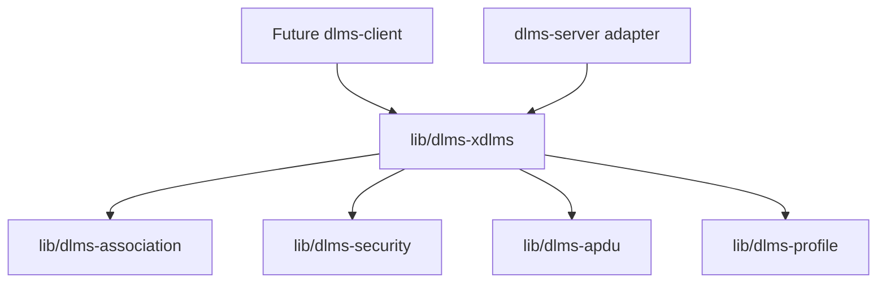

## 2. Normal GET Flow

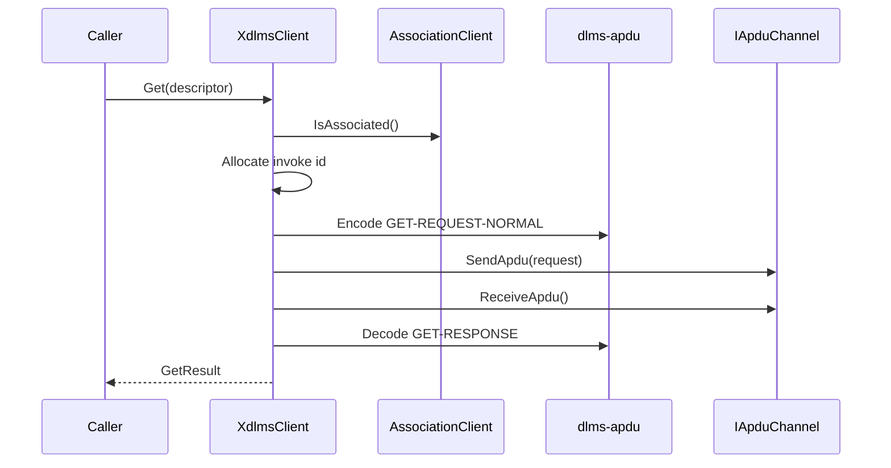

## 3. Class Interaction

## 4. Server Normal GET Flow

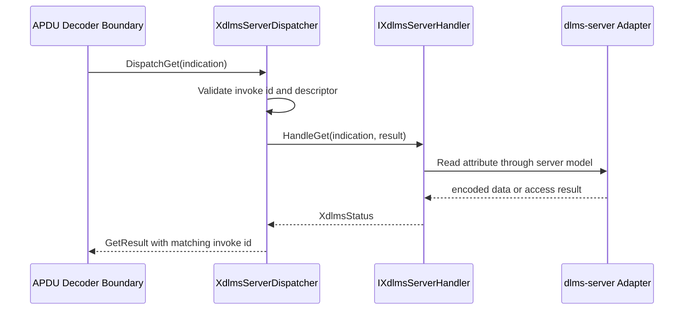

`dlms-xdlms` owns the xDLMS request and response shape. The embedding server
layer owns association policy, COSEM object access, and access-right decisions.

## 5. Server APDU GET Flow

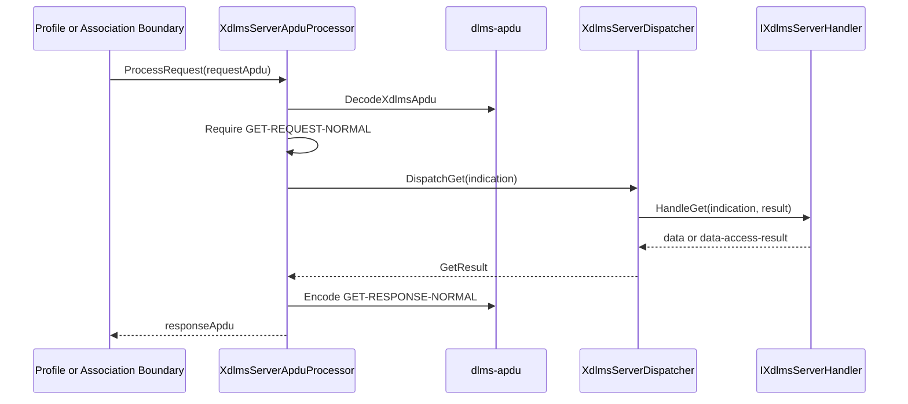

The processor handles xDLMS service bytes only. Profile framing, ACSE
association state, and ciphered APDU protection are still owned by adjacent
layers.

## 6. Server Normal SET Flow

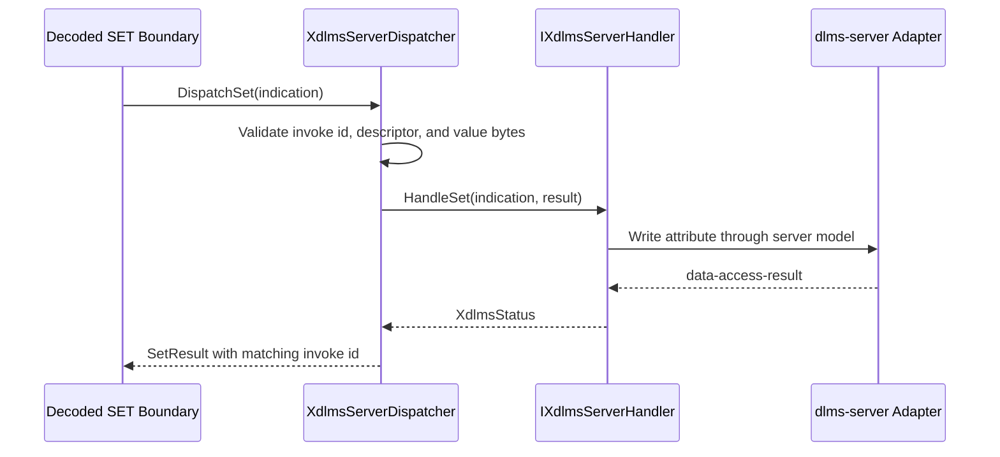

`dlms-xdlms` owns the SET service contract and result shape. The embedding
server layer owns write authorization, object lookup, and actual attribute
mutation.

## 7. Server APDU SET Flow

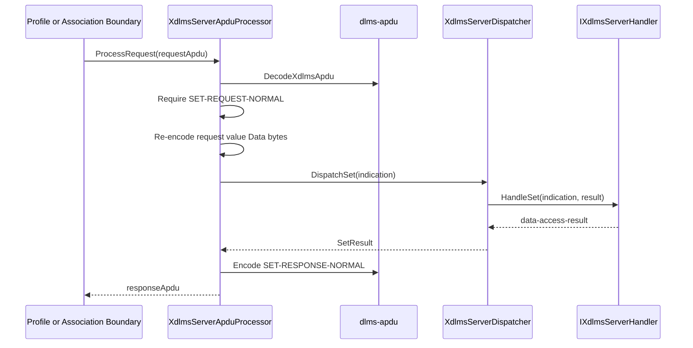

The processor does not evaluate write permissions and does not decode the
semantic COSEM value. It only preserves the xDLMS `Data` bytes across the APDU
and decoded-dispatch boundary.

## 8. Security APDU Boundary

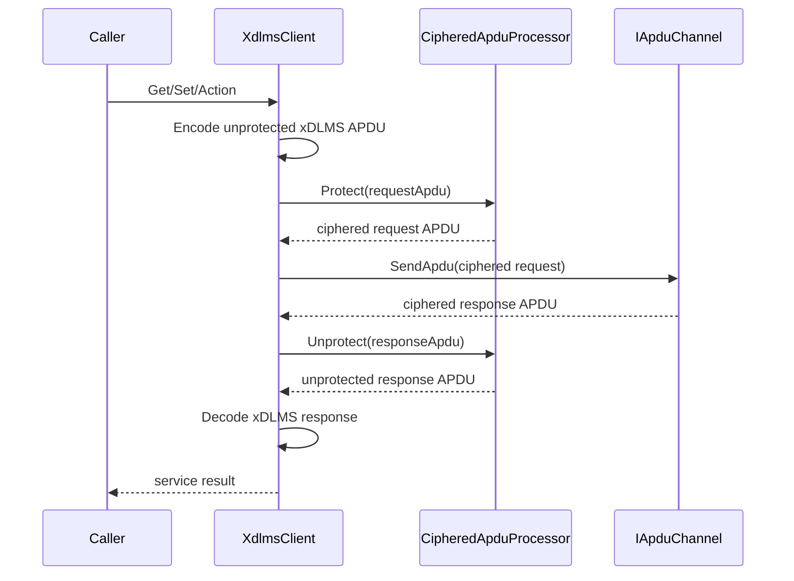

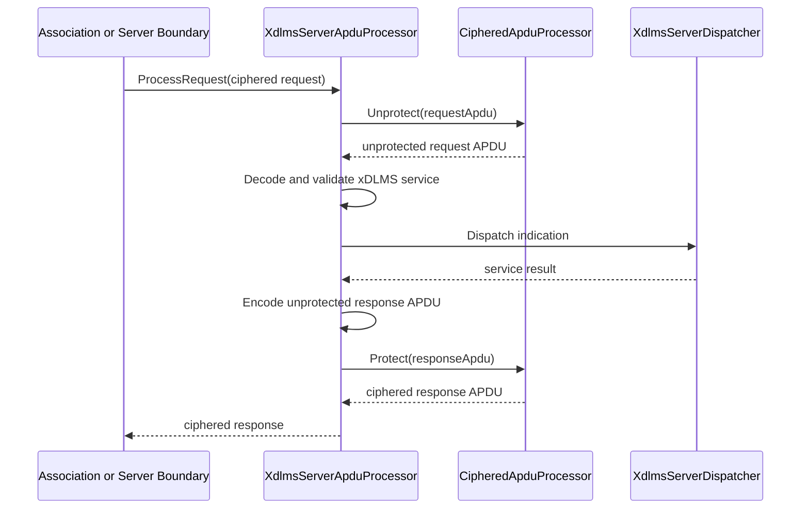

The xDLMS layer remains a consumer of `dlms-security`. It does not choose
keys, maintain invocation counters directly, build system titles, or implement
AES-GCM. It only preserves the DLMS/COSEM ordering: service APDU first,
ciphered APDU at the application-layer boundary.

## 9. Client GET Block Transfer

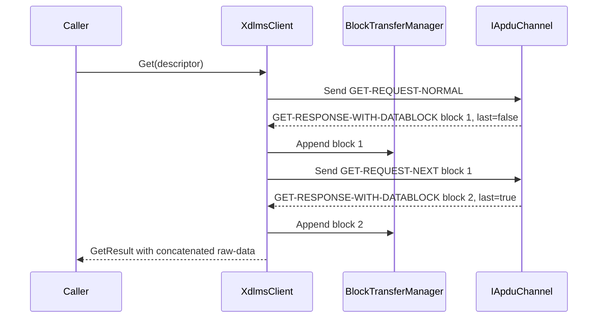

The block manager is scoped to one synchronous GET call. It validates block
numbers, enforces the collected-size limit, and returns the final raw-data
bytes to the existing `GetResult` contract.

## 9.1 Server GET Response Block Transfer

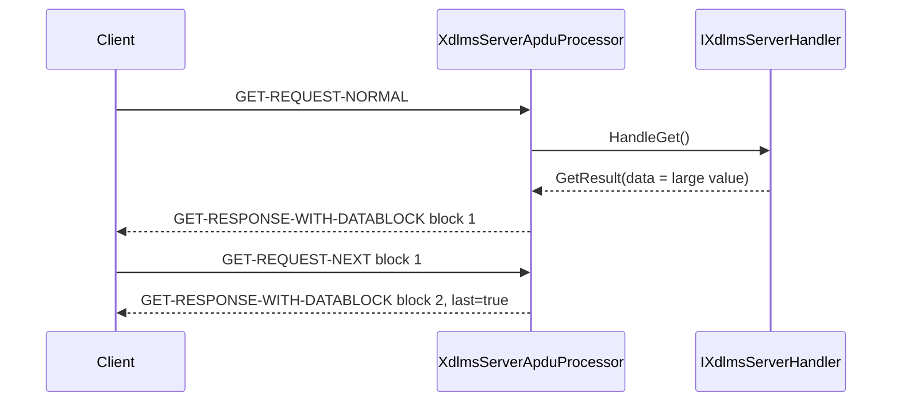

`XdlmsServerApduProcessor` owns one `GetResponseBlockState` alongside the
existing SET and ACTION request block states. The state stores the complete
encoded response data, the next block number, and the current offset. It is
cleared after the final block or on decode/invoke mismatch failures.

## 10. Client SET Block Transfer

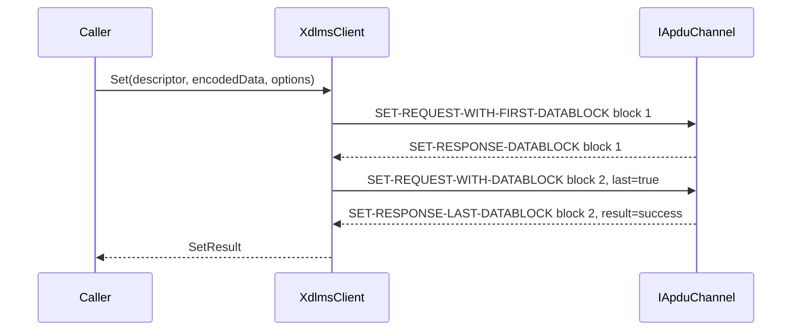

The SET block sender is scoped to one synchronous SET call. It reuses the same
invoke-id-and-priority byte for all blocks, validates acknowledged block
numbers, and returns the final data-access-result through the existing
`SetResult` contract.

## 11. Client ACTION Block Transfer

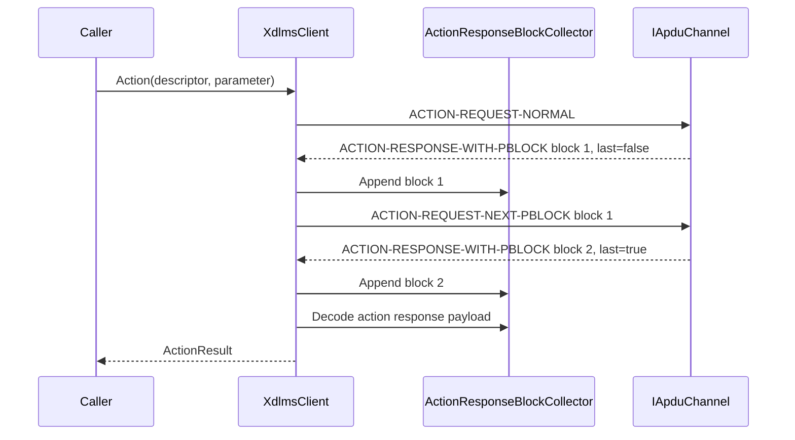

ACTION block transfer is kept separate from GET and SET because the service can
block both request invocation parameters and response return parameters.

## 12. Block State Machine

```mermaid
stateDiagram-v2
  [*] --> Idle

  Idle --> ClientGetCollecting: client receives GET response block\nlast=false
  ClientGetCollecting --> ClientGetCollecting: next GET response block\nlast=false and expected block
  ClientGetCollecting --> Idle: next GET response block\nlast=true
  ClientGetCollecting --> Idle: send/receive/decode/block error

  Idle --> ClientSetSending: SET payload exceeds request block limit
  ClientSetSending --> ClientSetSending: SET block ack matches expected block
  ClientSetSending --> Idle: SET last block response accepted
  ClientSetSending --> Idle: send/receive/decode/block error

  Idle --> ClientActionRequestSending: ACTION parameter exceeds request block limit
  ClientActionRequestSending --> ClientActionRequestSending: ACTION request pblock ack matches expected block
  ClientActionRequestSending --> ClientActionResponseCollecting: final request block accepted\nresponse starts pblocks
  ClientActionRequestSending --> Idle: final normal ACTION response accepted
  ClientActionRequestSending --> Idle: send/receive/decode/block error

  Idle --> ClientActionResponseCollecting: client receives ACTION response pblock\nlast=false
  ClientActionResponseCollecting --> ClientActionResponseCollecting: next ACTION response pblock\nlast=false and expected block
  ClientActionResponseCollecting --> Idle: next ACTION response pblock\nlast=true
  ClientActionResponseCollecting --> Idle: send/receive/decode/block error

  Idle --> ServerSetRequestActive: SET first data block\nlast=false
  ServerSetRequestActive --> ServerSetRequestActive: following SET data block\nlast=false and expected block
  ServerSetRequestActive --> Idle: following SET data block\nlast=true
  ServerSetRequestActive --> Idle: malformed, skipped, duplicate, or invoke mismatch

  Idle --> ServerActionRequestActive: ACTION first pblock\nlast=false
  ServerActionRequestActive --> ServerActionRequestActive: following ACTION pblock\nlast=false and expected block
  ServerActionRequestActive --> Idle: following ACTION pblock\nlast=true
  ServerActionRequestActive --> Idle: malformed, skipped, duplicate, or invoke mismatch

  Idle --> ServerGetResponseActive: oversized successful GET result
  ServerGetResponseActive --> ServerGetResponseActive: GET-REQUEST-NEXT matches latest sent block
  ServerGetResponseActive --> Idle: final GET response block sent
  ServerGetResponseActive --> Idle: missing state, wrong block, or invoke mismatch
```

Client block states are scoped to one synchronous service call. Server block
states are scoped to one `XdlmsServerApduProcessor` instance and one active
association/session. Each service direction owns independent state so SET
request reassembly, ACTION request reassembly, and GET response production do
not share buffers.

## 13. Ownership

`XdlmsClient` stores non-owning references to the association and profile APDU
channel boundaries and may store a non-owning reference to a security
processor. Server dispatch stores non-owning access to an xDLMS server handler.
The server APDU processor may also store a non-owning security processor
reference. The layer does not own transport resources, association lifetime,
security material, or COSEM object storage. Block-transfer state is limited to
one client service call or one active server APDU processor sequence.

## 14. Error Model

The layer returns status codes only. Runtime API paths do not throw exceptions.
Failures are reported at the xDLMS service boundary and do not close or release
the association.
