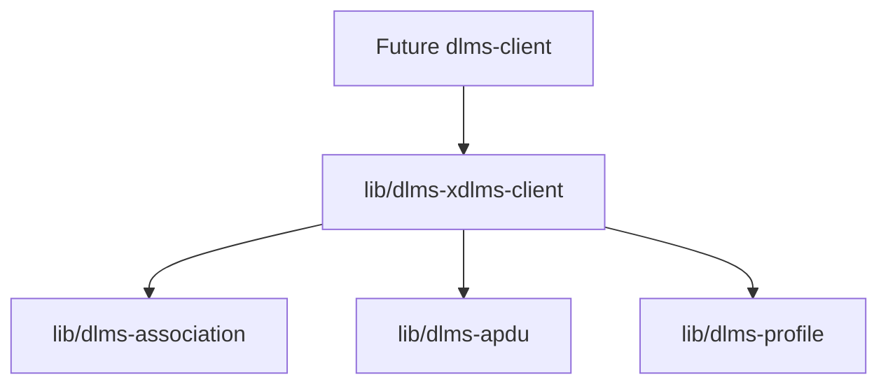
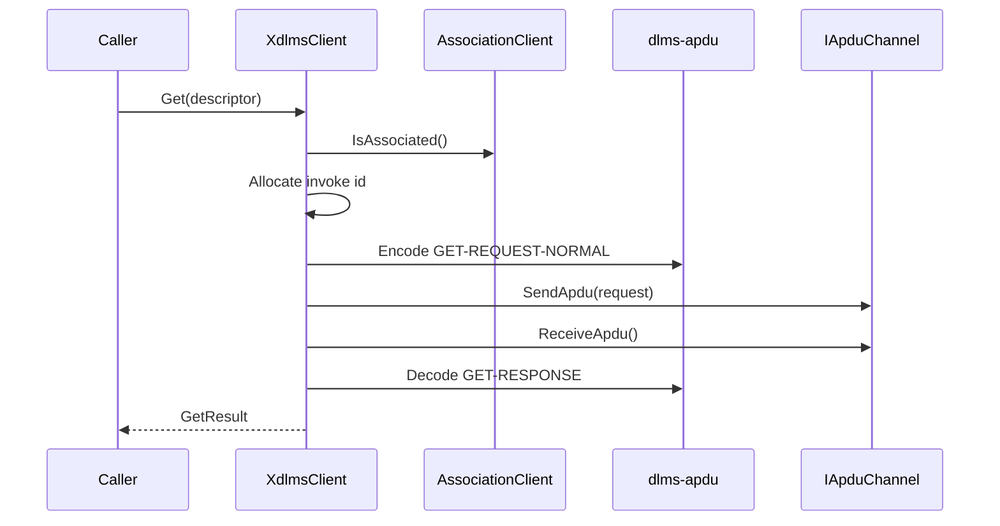
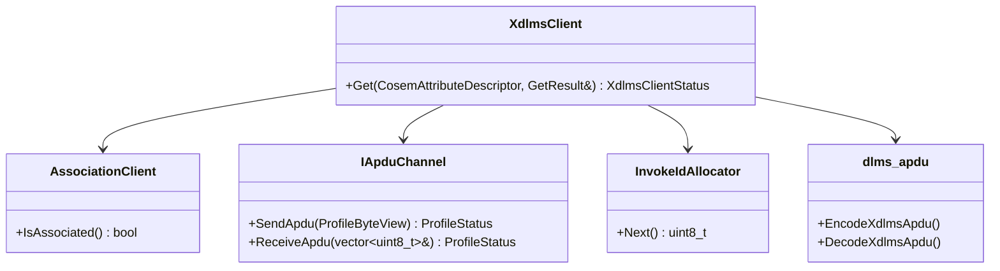

# dlms-xdlms-client Architecture

## 1. Layer Position

## 2. Normal GET Flow

## 3. Class Interaction

## 4. Ownership

`XdlmsClient` stores non-owning references to the association and profile APDU
channel boundaries. It does not own transport resources, association lifetime,
or COSEM object storage.

## 5. Error Model

The layer returns status codes only. Runtime API paths do not throw exceptions.
Failures are reported at the xDLMS service boundary and do not close or release
the association.
