# dlms-xdlms Architecture

## 1. Layer Position

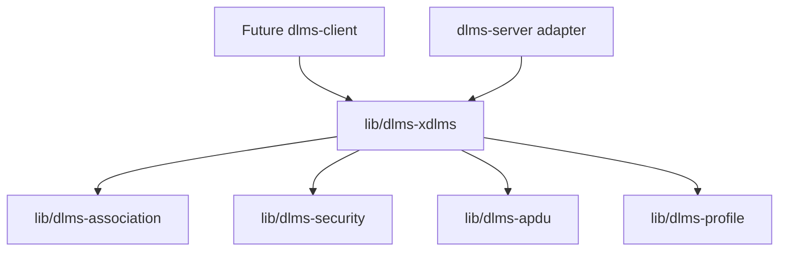

## 2. Normal GET Flow

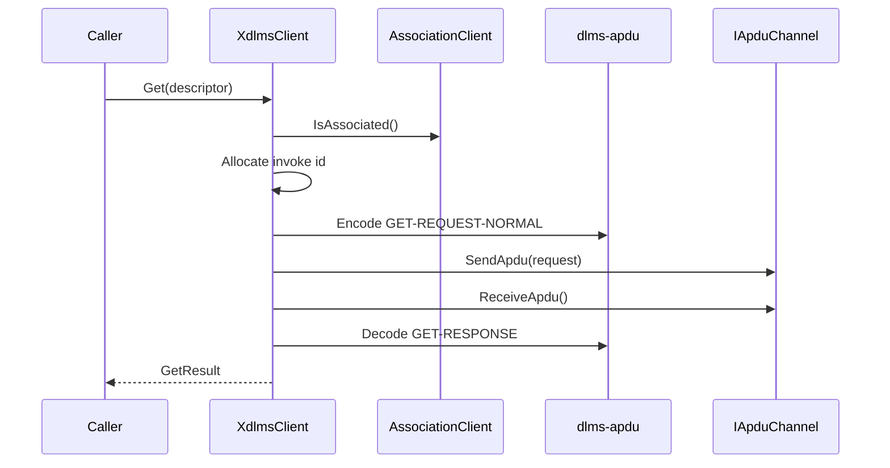

## 3. Class Interaction

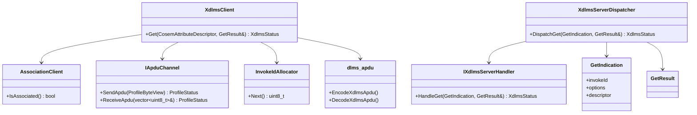

## 4. Server Normal GET Flow

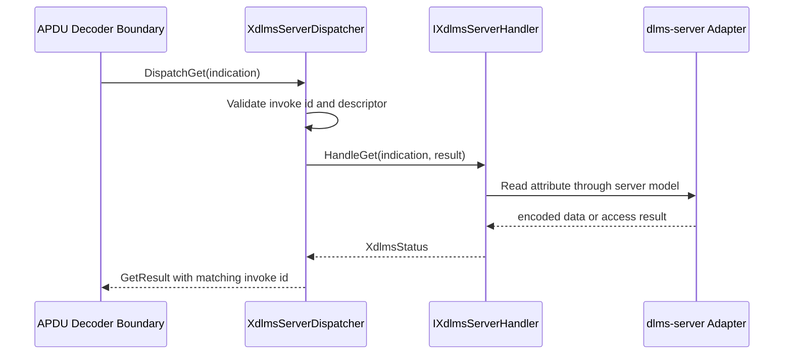

`dlms-xdlms` owns the xDLMS request and response shape. The embedding server
layer owns association policy, COSEM object access, and access-right decisions.

## 5. Server APDU GET Flow

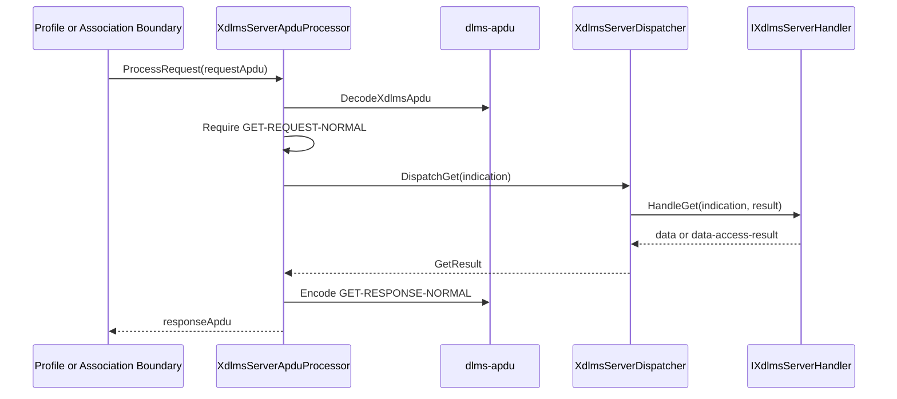

The processor handles xDLMS service bytes only. Profile framing, ACSE
association state, and ciphered APDU protection are still owned by adjacent
layers.

## 6. Server Normal SET Flow

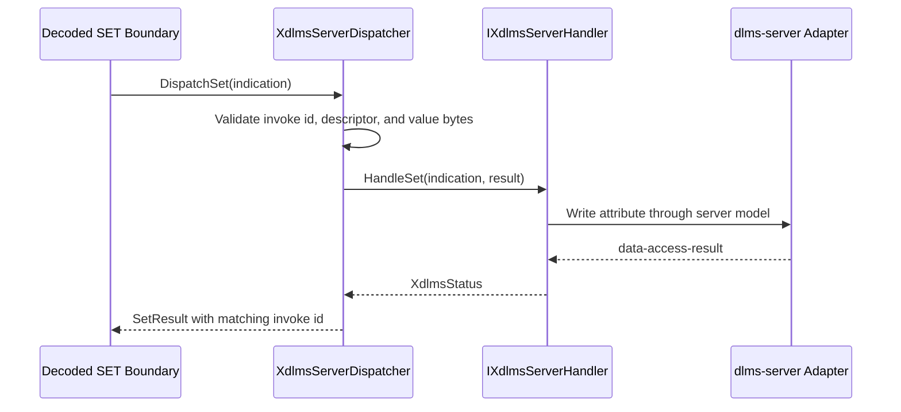

`dlms-xdlms` owns the SET service contract and result shape. The embedding
server layer owns write authorization, object lookup, and actual attribute
mutation.

## 7. Server APDU SET Flow

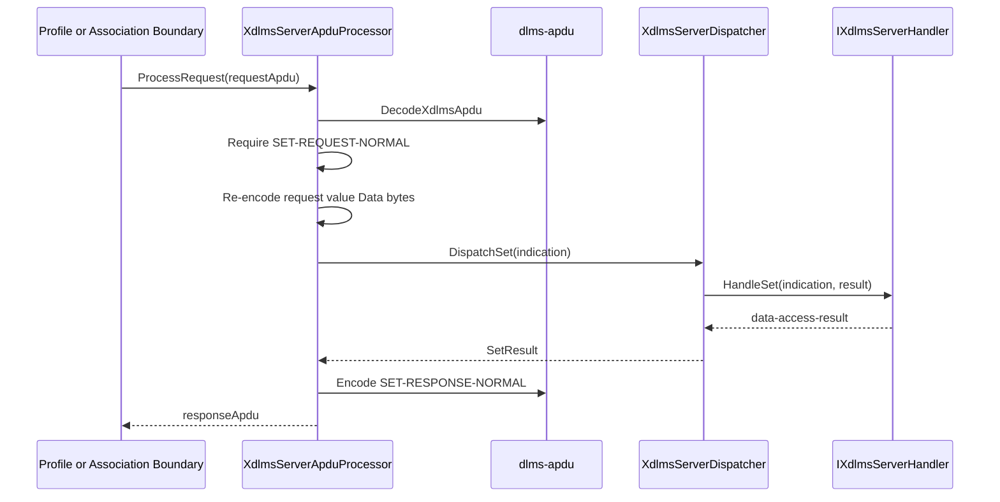

The processor does not evaluate write permissions and does not decode the
semantic COSEM value. It only preserves the xDLMS `Data` bytes across the APDU
and decoded-dispatch boundary.

## 8. Security APDU Boundary

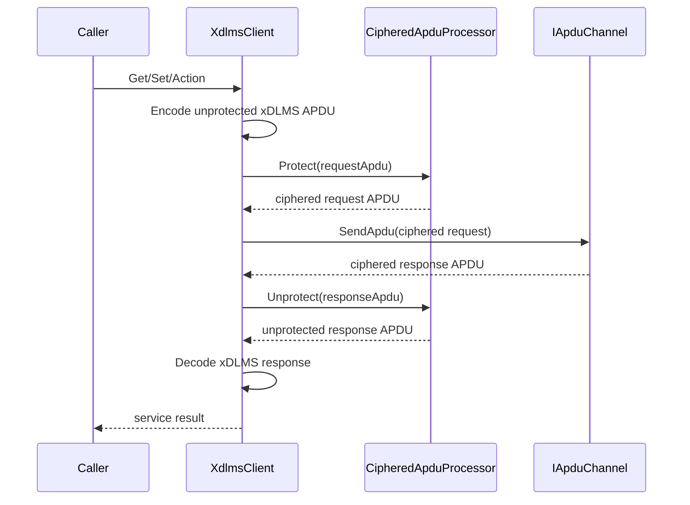

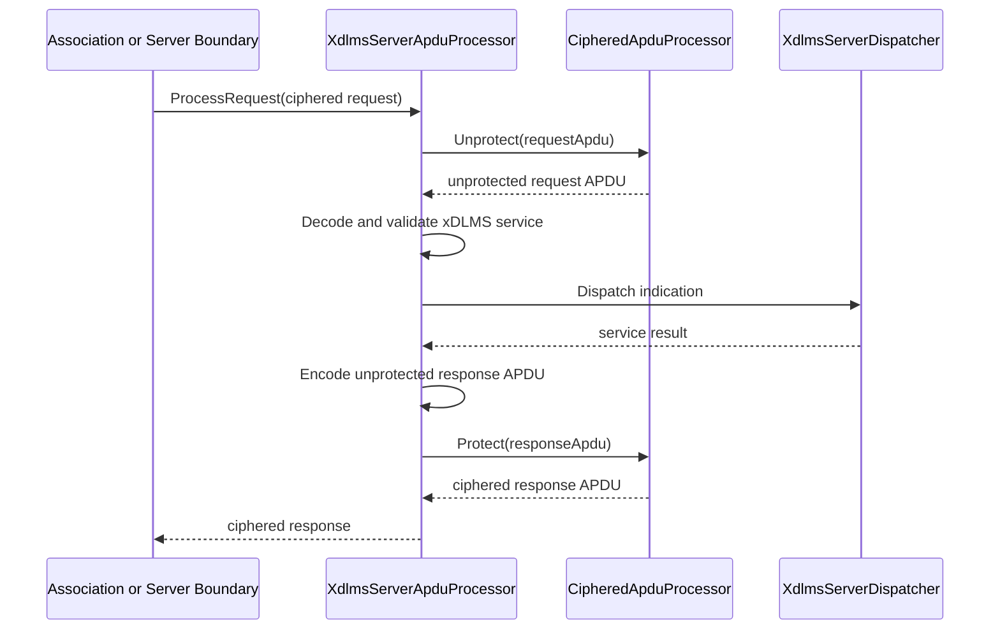

The xDLMS layer remains a consumer of `dlms-security`. It does not choose
keys, maintain invocation counters directly, build system titles, or implement
AES-GCM. It only preserves the DLMS/COSEM ordering: service APDU first,
ciphered APDU at the application-layer boundary.

## 9. Client GET Block Transfer

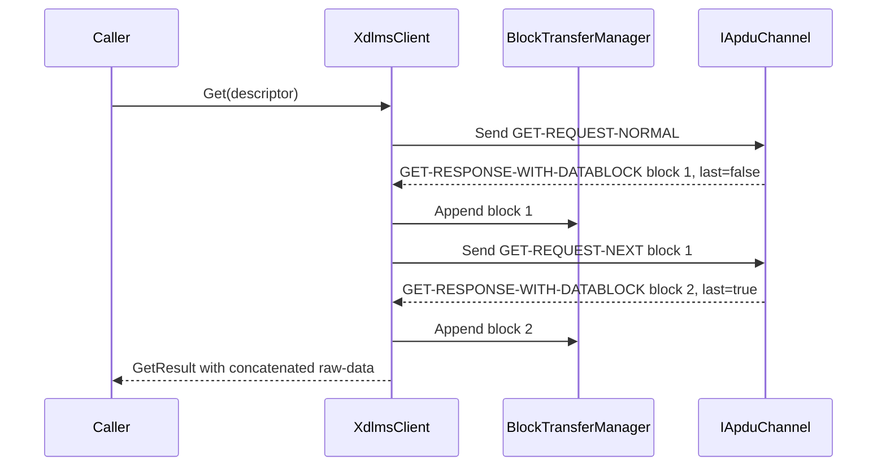

The block manager is scoped to one synchronous GET call. It validates block
numbers, enforces the collected-size limit, and returns the final raw-data
bytes to the existing `GetResult` contract.

## 10. Client SET Block Transfer

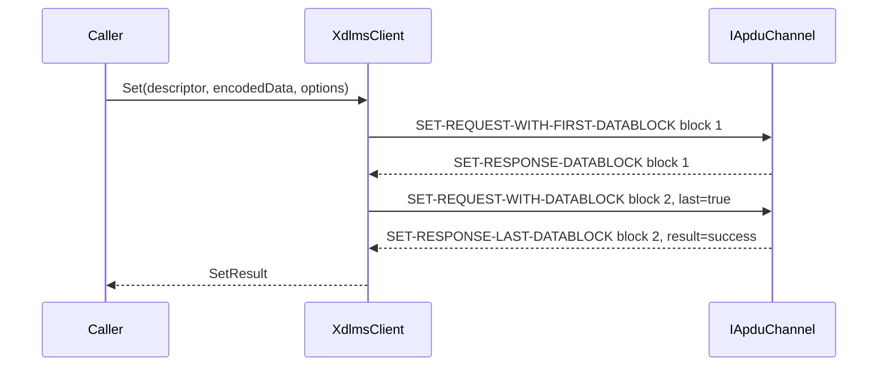

The SET block sender is scoped to one synchronous SET call. It reuses the same
invoke-id-and-priority byte for all blocks, validates acknowledged block
numbers, and returns the final data-access-result through the existing
`SetResult` contract.

## 11. Ownership

`XdlmsClient` stores non-owning references to the association and profile APDU
channel boundaries and may store a non-owning reference to a security
processor. Server dispatch stores non-owning access to an xDLMS server handler.
The server APDU processor may also store a non-owning security processor
reference. The layer does not own transport resources, association lifetime,
security material, COSEM object storage, or block-transfer persistence outside
one service call.

## 12. Error Model

The layer returns status codes only. Runtime API paths do not throw exceptions.
Failures are reported at the xDLMS service boundary and do not close or release
the association.
