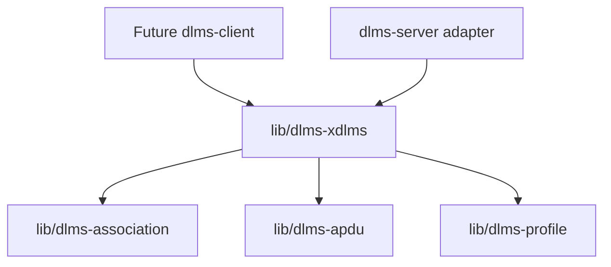
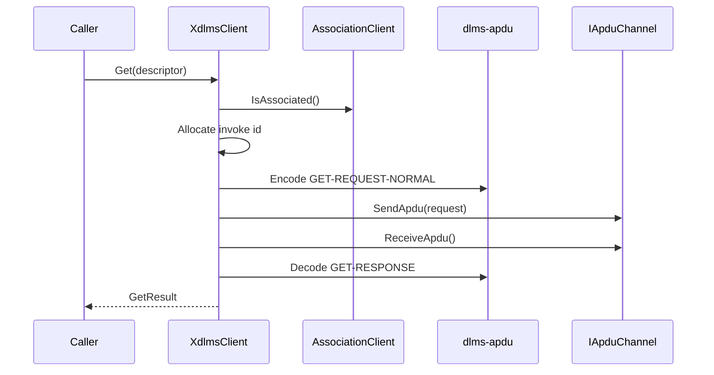
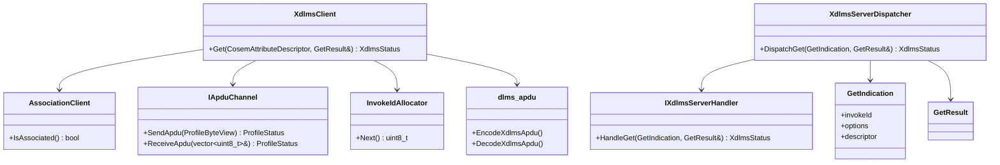
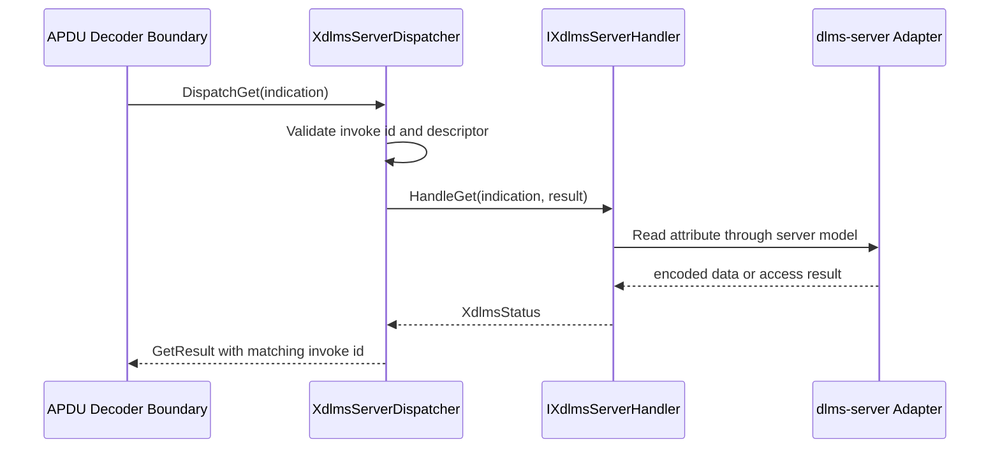
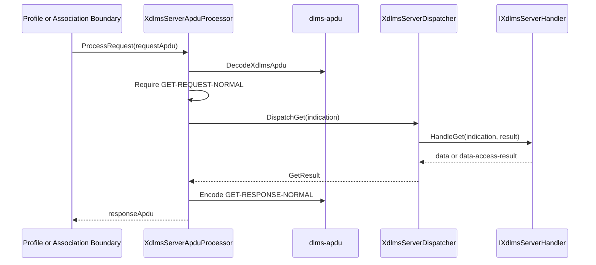
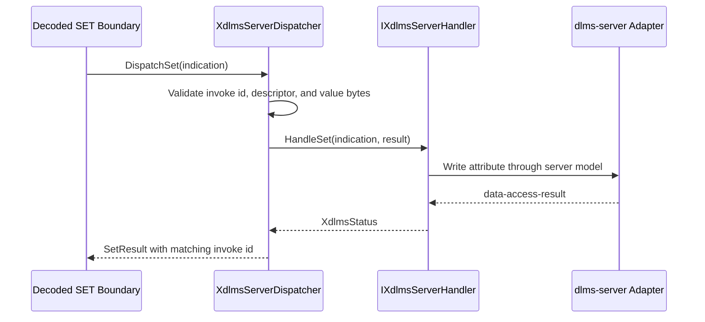

# dlms-xdlms Architecture

## 1. Layer Position

## 2. Normal GET Flow

## 3. Class Interaction

## 4. Server Normal GET Flow

`dlms-xdlms` owns the xDLMS request and response shape. The embedding server
layer owns association policy, COSEM object access, and access-right decisions.

## 5. Server APDU GET Flow

The processor handles xDLMS service bytes only. Profile framing, ACSE
association state, and ciphered APDU protection are still owned by adjacent
layers.

## 6. Server Normal SET Flow

`dlms-xdlms` owns the SET service contract and result shape. The embedding
server layer owns write authorization, object lookup, and actual attribute
mutation.

## 7. Ownership

`XdlmsClient` stores non-owning references to the association and profile APDU
channel boundaries. Server dispatch stores non-owning access to an xDLMS server
handler. The layer does not own transport resources, association lifetime, or
COSEM object storage.

## 8. Error Model

The layer returns status codes only. Runtime API paths do not throw exceptions.
Failures are reported at the xDLMS service boundary and do not close or release
the association.
